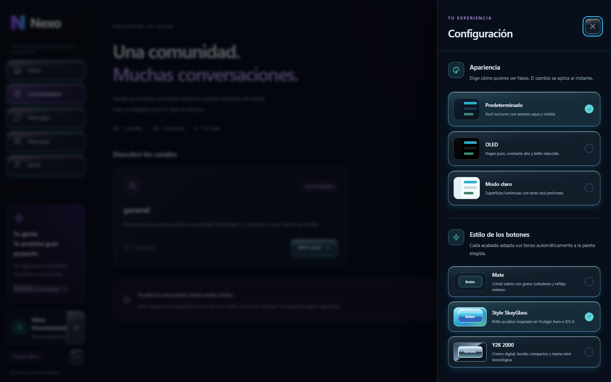
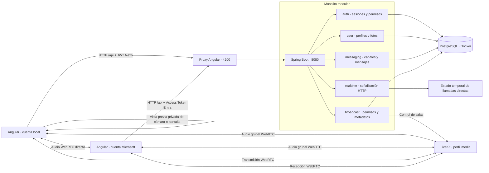
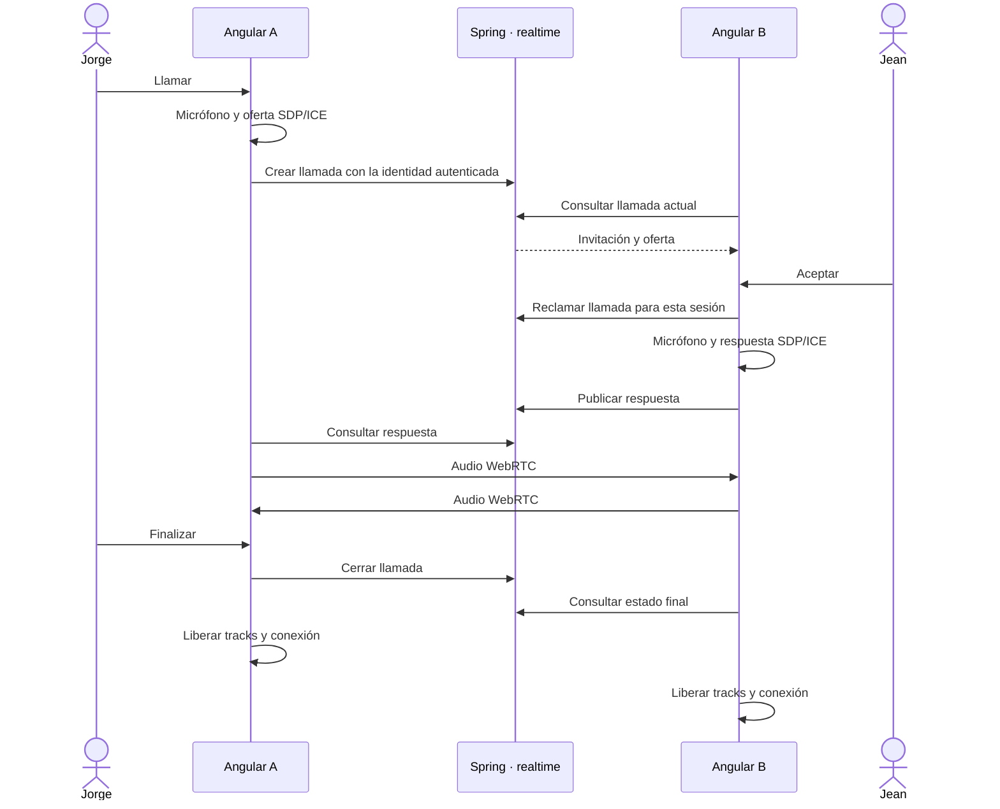
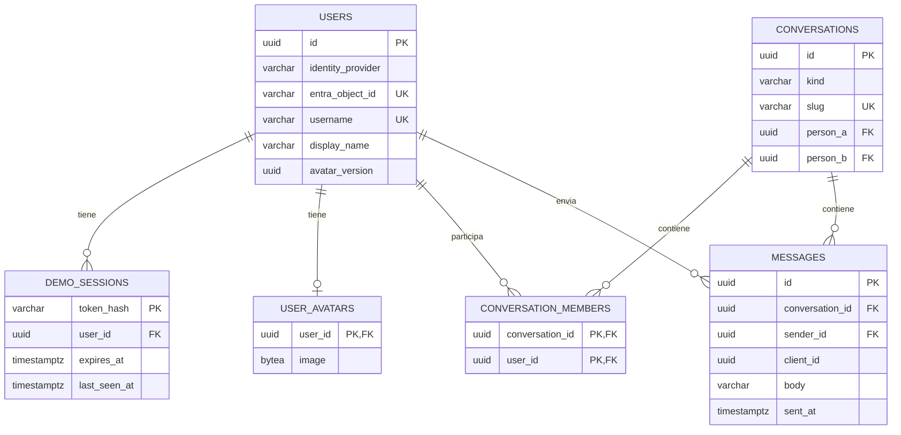

# Nexo · Comunidad universitaria

<p align="center">
  <br>
  <strong>Tu campus. Tu gente. Tu espacio.</strong><br>
  Proyecto de tesis · Despliegue académico funcional
</p>

<p align="center">
  <a href="#producto">Producto</a> ·
  <a href="profile-streaming-implementation-plan.md">Plan a seguir</a> ·
  <a href="#arquitectura">Arquitectura</a> ·
  <a href="#instalacion">Instalación</a> ·
  <a href="#api">API</a> ·
  <a href="#pruebas">Pruebas</a> ·
  <a href="CONTRIBUTING.md">Contribuir</a>
</p>


> **Estado actual:** despliegue académico operativo sobre EC2 y RDS, servido por
> HTTPS en una IP elástica mediante `nip.io`. Incluye MSAL/Entra ID, JWT validado
> por Spring, mensajería, voz directa con TURN, llamadas grupales y transmisiones
> mediante LiveKit. Verificación del 9 de septiembre de 2026: 42 pruebas backend
> y 77 frontend aprobadas. API Gateway, WebSocket persistente y los controles de
> producción permanecen en el backlog verificado de esta rama.

## Índice

- [Producto y capturas](#producto)
- [Plan a seguir](profile-streaming-implementation-plan.md)
- [Alcance implementado](#alcance)
- [Stack y requisitos](#stack)
- [Arquitectura](#arquitectura)
- [Estructura del repositorio](#estructura)
- [Modelo de datos](#datos)
- [Ejecución local](#instalacion)
- [Guion de demostración](#demo)
- [API y errores](#api)
- [Seguridad y privacidad](#seguridad)
- [Pruebas y CI](#pruebas)
- [Git Pattern](#git-pattern)
- [Operación y solución de problemas](#operacion)
- [Próximas etapas](#roadmap)
- [Documentación y licencia](#documentacion)

<a id="producto"></a>

## Producto y capturas

Nexo organiza la experiencia alrededor de personas, conversaciones y comunidades
universitarias. Usa navegación con nombres, bandeja de conversaciones, burbujas de
mensajes y panel contextual. La identidad visual ofrece temas predeterminado, OLED y
claro, combinables con botones Mate, Style SkayGlass o Y2K 2000. La interfaz admite
teclado, conserva las preferencias visuales y adapta su disposición a móvil.

### Mensajería


Canales y conversaciones directas con texto persistente, enlaces navegables,
avatares y distinción entre mensajes propios y recibidos.

### Comunidades


El espacio autenticado local inicia con el canal `general`; el modo demostración
mantiene además `desarrollo`, `ideas-y-proyectos` y `vida-universitaria`. Cada
perfil puede consultar sus membresías, unirse y salir.

### Apariencia



Los temas predeterminado, OLED y claro pueden combinarse con los acabados Mate,
Style SkayGlass y Y2K 2000. La selección se aplica al instante y permanece en el
navegador.

<details>
<summary><strong>Ver perfil y foto opcional</strong></summary>


La foto es opcional: seleccionar JPG/PNG, revisar la vista previa, guardar o
quitar la imagen para recuperar las iniciales.

</details>

Son capturas de la aplicación local real, no de funcionalidades futuras.
La cuenta y el mensaje preparados para documentar la interfaz se eliminaron del
entorno local después de capturarlos; las imágenes no importan esos datos a una
instalación nueva.
[Origen de las capturas](docs/images/README.md).

<a id="alcance"></a>

## Alcance implementado

| Área       | Disponible                                                                                                  | Límite actual                                                                    |
| ---------- | ----------------------------------------------------------------------------------------------------------- | -------------------------------------------------------------------------------- |
| Acceso     | Demo, registro/login local y Microsoft Entra ID mediante MSAL; login institucional probado                   | Falta matriz formal de logout y errores por cuenta                               |
| Navegación | Login, Inicio, Comunidades, Mensajes, Personas, Perfil y diagnóstico                                        | Sin administración institucional                                                 |
| Canales    | Descubrir, unirse, salir, ver participantes y conversar                                                     | Cuatro canales predefinidos; sin creación desde UI                               |
| Directos   | Conversaciones entre dos perfiles con autorización backend                                                  | Sin grupos privados ni confirmaciones de lectura                                 |
| Historial  | PostgreSQL; envío idempotente, edición/borrado del autor, copiar, responder y reenviar                      | Últimos 100 mensajes; respuestas y reenvíos se representan como texto, sin hilos |
| Apariencia | Temas predeterminado, OLED y claro; botones Mate, Style SkayGlass y Y2K 2000; configuración junto al nombre | Preferencias locales de cada navegador, sin sincronización entre dispositivos    |
| Enlaces    | Reconoce `http://`, `https://` y `www.`                                                                     | Sin previews ni verificación de reputación                                       |
| Perfil     | Panel reutilizable, edición autenticada, disponibilidad y foto opcional normalizada                         | Sin campos institucionales ni configuración de privacidad                        |
| Llamadas   | Voz directa P2P y salas grupales de canal mediante LiveKit; mute, salida y contador de participantes         | Sin video; las salas grupales requieren LiveKit disponible                       |
| Presencia  | Actividad reciente de sesiones                                                                              | Polling HTTP; no hay WebSocket                                                   |
| Transmisiones | Cámara/pantalla, micrófono opcional y 15/30/60 FPS mediante LiveKit; visor en canal o llamada | 60 FPS es un objetivo dependiente del dispositivo/red; pendientes medios físicos y redes externas |
| Operación  | EC2, RDS, Docker con reinicio automático, Caddy HTTPS, health, Actuator y Swagger                            | Acceso directo vía proxy; falta API Gateway y observabilidad centralizada        |

<a id="stack"></a>

## Stack y requisitos

| Capa            | Tecnología utilizada                                                 |
| --------------- | -------------------------------------------------------------------- |
| Frontend        | Angular 21.2, TypeScript 5.9, Tailwind CSS 4, RxJS 7.8               |
| Diseño Angular  | Standalone Components, signals, Reactive Forms y rutas lazy          |
| Voz             | WebRTC del navegador y `getUserMedia`                                |
| Transmisiones   | LiveKit Server 1.13.6, cliente web 2.22.2 y SDK servidor 0.15.1       |
| Backend         | Java 21, Spring Boot 3.5.16, Maven Wrapper 3.9.16                    |
| API             | Spring Web, Bean Validation, DTOs y errores uniformes                |
| Seguridad       | Spring Security, JWT local/Entra, scopes/roles y bearer demo aislado |
| Persistencia    | PostgreSQL 17.10, JPA/Hibernate, JdbcClient y Flyway                 |
| Observabilidad  | Actuator y springdoc OpenAPI 2.8.17                                  |
| Pruebas         | JUnit 5, Spring Security Test, Testcontainers, Vitest y jsdom        |
| Infraestructura | Docker Compose; backend Docker opcional                              |

Instalar **Node.js 24**, **npm 11**, **JDK 21** y **Docker Desktop con motor Linux**
o Docker Engine con Compose. Configurar `JAVA_HOME`. Angular CLI está incluido en
las dependencias: no necesita instalación global. Maven se descarga mediante el
wrapper; su distribución tiene checksum fijado en el repositorio.

Las versiones resueltas del frontend están en `frontend/package-lock.json`.
Usar `npm ci` para reproducirlas. La primera ejecución requiere Internet para
dependencias e imágenes; no necesita credenciales Microsoft.

<a id="arquitectura"></a>

## Arquitectura

**Monorepo y monolito modular:** una SPA Angular, una sola aplicación Spring Boot
y PostgreSQL. El backend está organizado por dominios, no por capas globales.
No hay microservicios de negocio. Las llamadas directas de voz son P2P; las llamadas
grupales de canal y las transmisiones usan LiveKit como servidor multimedia SFU.
Spring controla permisos y
metadatos, pero no transporta ni almacena audio/video. La vista previa permanece
en el navegador hasta que el usuario inicia la transmisión.



### Responsabilidades y decisiones

- **auth:** emite JWT para cuentas locales, valida Access Tokens de Entra y mantiene
  credenciales opacas sólo para la demo. Todos convergen en una identidad Nexo
  controlada por el backend.
- **user:** conserva perfiles y procesa fotos. JPA administra usuarios;
  JdbcClient guarda y consulta los bytes del avatar.
- **messaging:** workspace autenticado, conversaciones, miembros y mensajes.
  Consultas parametrizadas, transacciones y restricciones de base controlan
  permisos e idempotencia.
- **realtime:** intercambia SDP entre participantes autorizados. El audio viaja
  entre navegadores; la señalización temporal permanece en memoria del monolito.
- **common:** CORS, errores, health y OpenAPI.
- **broadcast:** autoriza miembros, emite tokens breves por rol y controla salas
  LiveKit y su vencimiento. También entrega acceso temporal de publicación/suscripción
  a la sala grupal estable de cada canal; persiste metadatos, nunca medios ni tokens.
- **Angular core:** sesión, guard, interceptor, clientes HTTP y voz; los componentes
  de página no duplican autenticación.

Los mensajes se consultan cada **2 s**, workspace cada **5 s** y señalización de
llamadas cada **1,5 s**. La presencia representa actividad en los últimos **45 s**.
WebSocket será una evolución posterior; estos intervalos no garantizan entrega instantánea.

### Ciclo de llamada



Solo la primera sesión del destinatario que acepta puede atender. Un usuario
ocupado no recibe otra llamada. Invitaciones y negociaciones vencen a los 45 s;
la ausencia de actividad también vence a los 45 s. La limpieza se evalúa al
atender peticiones. El permiso de micrófono pendiente tiene un límite de 30 s.

<a id="estructura"></a>

## Estructura del repositorio

```text
ProyectoTesis/
├── .github/
│   ├── workflows/ci.yml          # Frontend y backend
│   ├── ISSUE_TEMPLATE/           # Bugs y propuestas
│   ├── pull_request_template.md  # Cambio, pruebas y riesgos
│   └── CODEOWNERS                # Responsable de revisión
├── backend/
│   ├── .mvn/wrapper/             # Maven y checksum
│   ├── mvnw / mvnw.cmd
│   ├── pom.xml
│   ├── Dockerfile
│   ├── README.md
│   └── src/
│       ├── main/java/com/nexo/
│       │   ├── auth/             # config y demo
│       │   ├── user/             # controller/service/repository/entity/dto
│       │   ├── messaging/        # controller/service/repository/dto
│       │   ├── realtime/         # controller/service
│       │   ├── common/           # config/exception/health/response
│       │   └── NexoApplication.java
│       ├── main/resources/
│       │   ├── application.yml
│       │   ├── application-local-demo.yml
│       │   └── db/               # migration y demo
│       └── test/java/com/nexo/
├── frontend/
│   ├── public/                   # Recursos estáticos
│   ├── src/app/
│   │   ├── core/                 # auth/guards/interceptors/media/models/services/realtime
│   │   ├── shared/components/    # Avatar, iconos, enlaces y llamada
│   │   ├── features/             # auth/home/status y estudio multimedia
│   │   ├── app.config.ts
│   │   └── app.routes.ts
│   ├── src/environments/         # Valores públicos; nunca secretos
│   ├── angular.json
│   ├── package.json
│   ├── package-lock.json
│   └── proxy.conf.json
├── docs/
│   ├── images/                   # Capturas reales versionadas
│   ├── git-workflow.md           # Ramas, commits y GitHub
│   └── *verification.md          # Evidencia por etapa
├── scripts/verify-local.ps1
├── .editorconfig
├── .env.example
├── .gitattributes
├── .gitignore
├── .nvmrc
├── docker-compose.yml
├── CONTRIBUTING.md
├── SECURITY.md
└── README.md
```

Los tests Angular viven junto al código. No se versionan `.env`, dependencias
descargadas, volúmenes PostgreSQL, `target`, `dist` ni caches.

<a id="datos"></a>

## Modelo de datos



El diagrama resume campos y relaciones; las migraciones son la definición completa.
Los IDs son UUID. La pareja de usuarios de un directo se normaliza para impedir
duplicados. La clave única `(conversation_id, sender_id, client_id)` impide
duplicar un mensaje al reintentarlo.

| Migración | Propósito                                                                                               |
| --------- | ------------------------------------------------------------------------------------------------------- |
| V0        | Crear schema `nexo`                                                                                     |
| V1        | Usuarios locales, proveedor y campos preparados para Entra                                              |
| V2        | Sesiones, conversaciones, miembros, mensajes e índices                                                  |
| V3        | Tres perfiles, cuatro canales y mensajes ficticios; solo `local-demo`                                   |
| V4        | Fotos `bytea` y versión UUID                                                                            |
| V5–V7     | Identidad local, contraseñas BCrypt y nombres de usuario Entra                                          |
| V8        | Canal `general` común y membresía inicial para usuarios activos                                         |
| V9        | Disponibilidad, protección de personalizaciones e identificador público único sin distinguir mayúsculas |
| V10       | Metadatos y estados de transmisiones; índices por conversación y un único directo activo por anfitrión |

Flyway guarda su historial en `public`; Hibernate usa `ddl-auto=validate`.
No editar migraciones aplicadas: agregar una nueva. Desactivar `local-demo` no
borra datos ya sembrados. La futura instalación real necesita una base limpia
y una transición de identidad revisada.

<a id="instalacion"></a>

## Ejecución local

### 1. Clonar y configurar

```bash
git clone https://github.com/JorgeVergaraS/ProyectoTesis.git
cd ProyectoTesis
```

Copiar `.env.example` a `.env` **solo si no existe**. Reemplazar `change-me`
por una contraseña local y usar el mismo valor en `POSTGRES_PASSWORD` y
`SPRING_DATASOURCE_PASSWORD`. Añadir para habilitar explícitamente la demo:

```env
SPRING_PROFILES_ACTIVE=local-demo
```

| Variable                                                   | Uso                                                                  |
| ---------------------------------------------------------- | -------------------------------------------------------------------- |
| `POSTGRES_DB`, `POSTGRES_USER`                             | Base y usuario; ejemplo `nexo`                                       |
| `POSTGRES_PASSWORD`                                        | Contraseña del contenedor; obligatoria, no versionada                |
| `POSTGRES_PORT`                                            | Puerto host de PostgreSQL; 5432                                      |
| `SPRING_DATASOURCE_URL`                                    | `jdbc:postgresql://localhost:5432/nexo`                              |
| `SPRING_DATASOURCE_USERNAME`, `SPRING_DATASOURCE_PASSWORD` | Acceso JDBC del backend                                              |
| `SPRING_PROFILES_ACTIVE`                                   | `local-demo` habilita perfiles de prueba                             |
| `SERVER_PORT`                                              | Puerto del backend local; 8080                                       |
| `CORS_ALLOWED_ORIGINS`                                     | Origen permitido; `http://localhost:4200`                            |
| `AZURE_*`                                                  | Tenant, audience, JWK Set URI y scope públicos; nunca Client Secrets |

Spring importa `.env` desde la raíz al iniciar en `backend/`; las variables del
proceso tienen precedencia. Usar valores sin comillas compatibles con Java
Properties; una contraseña alfanumérica evita escapes. Si se cambia el puerto
de PostgreSQL, actualizar también JDBC.

### 2. PostgreSQL

```bash
docker compose up -d --wait
docker compose ps
```

Debe quedar `healthy`. El volumen `postgres_data` conserva la información.

### 3. Backend

PowerShell, desde la raíz:

```powershell
cd backend
.\mvnw.cmd spring-boot:run
```

Linux/macOS:

```bash
cd backend
./mvnw spring-boot:run
```

### 4. Frontend, en otra terminal

```bash
cd frontend
npm ci
npm start
```

En PowerShell puede usarse `npm.cmd` si se bloquea `npm.ps1`; no cambiar políticas
del equipo. `npx ng serve` equivale a `npm start`. Angular usa `apiUrl: '/api'`
y el proxy redirige a Spring en 8080. Los environments son públicos y no contienen
client secrets. Un build de producción no incluye un servidor/proxy: el futuro
hosting deberá configurarlos.

### URLs

| Recurso        | URL                                                                                         |
| -------------- | ------------------------------------------------------------------------------------------- |
| Acceso         | [localhost:4200/login](http://localhost:4200/login)                                         |
| Comunidad      | [localhost:4200/home](http://localhost:4200/home)                                           |
| Perfil         | [localhost:4200/profile](http://localhost:4200/profile)                                     |
| Diagnóstico    | [localhost:4200/status](http://localhost:4200/status)                                       |
| Health         | [localhost:8080/api/public/health](http://localhost:8080/api/public/health)                 |
| Readiness + DB | [localhost:8080/actuator/health/readiness](http://localhost:8080/actuator/health/readiness) |
| Swagger        | [localhost:8080/swagger-ui/index.html](http://localhost:8080/swagger-ui/index.html)         |

### Backend en Docker, opcional

```bash
docker compose --profile app up -d --build --wait
```

Detener antes el backend local en 8080. Docker conecta Spring al host `postgres`,
espera el health de la base y ejecuta Java sin root. La imagen omite tests al
construirse: se ejecutan por separado con Maven/CI. Angular sigue con `ng serve`.
La verificación reciente de voz se hizo con Spring local, no con el contenedor backend.

<a id="demo"></a>

## Guion de demostración

1. Entrar como **Jorge**; abrir otra pestaña nueva en `/login` como **Jean**.
2. Abrir `general`, enviar un mensaje y comprobar su recepción sin recargar.
3. Explorar otro canal: cada perfil debe unirse para acceder.
4. Abrir un directo Jorge–Jean; Fernando no puede leerlo.
5. Enviar `https://example.com` y abrir el enlace desde el mensaje.
6. Ir a Perfil, elegir un JPG/PNG de hasta 2 MiB, guardar y comprobar el avatar.
7. En el directo, pulsar el teléfono; Jean recibe la invitación y acepta.
8. Permitir el micrófono, esperar **Audio conectado**, probar mute y finalizar.
9. En Perfil, abrir **Preparar transmisión**, elegir cámara o pantalla y permitir los
   dispositivos solo cuando el navegador lo solicite.
10. Comprobar la vista previa privada, cambiar cámara/micrófono, probar mute y finalizar.
11. Recargar para comprobar persistencia; cerrar sesión para bloquear las rutas privadas.

No usar **Duplicar pestaña**: algunos navegadores copian `sessionStorage`.
Crear una nueva o usar **Abrir otra sesión**, que emplea `noopener`. En móvil,
el menú superior abre navegación; participantes permite consultar el canal.

**Voz:** usar audífonos para evitar acople. Si se bloquea el autoplay, pulsar
**Activar audio recibido**. El micrófono del destinatario se solicita al aceptar.
El aviso entrante es visual; la llamada permanece al navegar entre rutas. No se graba.

**Estudio local:** la vista previa tampoco se graba ni se transmite. Al volver,
cerrar el perfil, cambiar de ruta o terminar manualmente, Nexo detiene todos los
tracks. Compartir pantalla completa puede exponer notificaciones; es preferible
elegir una ventana concreta. **Iniciar transmisión** publica cámara/pantalla y micrófono
en la conversación elegida cuando LiveKit está habilitado. Los demás miembros pueden abrir
**Ver transmisión** desde el canal. Consulta la [guía de transmisión local](docs/broadcast-sfu-verification.md).

En cloud se configuran STUN y TURN para las llamadas directas; la aceptación final
entre navegadores y redes continúa abierta. El micrófono requiere localhost o HTTPS; una IP
por HTTP no es equivalente. Referencias:
[getUserMedia](https://developer.mozilla.org/en-US/docs/Web/API/MediaDevices/getUserMedia)
y [conectividad WebRTC](https://webrtc.org/getting-started/peer-connections).

<a id="api"></a>

## API y errores

Base local: `http://localhost:8080`. Swagger documenta los contratos. Las rutas
autenticadas aceptan un JWT local con `ROLE_USER` o un Access Token Entra válido
con `access_as_user`. Las rutas demo conservan una credencial opaca separada.

| Método        | Ruta                                      | Acceso / comportamiento                                                             |
| ------------- | ----------------------------------------- | ----------------------------------------------------------------------------------- |
| GET           | `/api/public/health`                      | Público; estado básico                                                              |
| POST          | `/api/auth/register`                      | Registro local; correo válido y contraseña de 8+ caracteres                         |
| POST          | `/api/auth/login`                         | Login local; entrega JWT con issuer/audience propios                                |
| GET           | `/api/users/me`                           | Perfil autenticado; exige `ROLE_USER` o `SCOPE_access_as_user`                      |
| PATCH         | `/api/users/me/profile`                   | Edita nombre, identificador público, biografía, color y disponibilidad propios      |
| POST / DELETE | `/api/users/me/avatar`                    | Multipart `file` / quitar la foto de la cuenta autenticada                          |
| GET           | `/api/avatars/{userId}/{version}`         | PNG público normalizado; solo responde para la versión vigente de un usuario activo |
| GET           | `/api/workspace`                          | Canales, directos y personas para la cuenta autenticada                             |
| POST          | `/api/directs`                            | Abrir un directo con `userId`; impide hablar consigo mismo                          |
| POST / DELETE | `/api/conversations/{id}/membership`      | Unirse / salir de un canal                                                          |
| GET           | `/api/conversations/{id}/members`         | Participantes; exige membresía                                                      |
| GET / POST    | `/api/conversations/{id}/messages`        | Consultar / enviar; identidad derivada del token                                    |
| GET           | `/api/calls/current`                      | Llamada de voz de esta pestaña autenticada; cuerpo vacío si no existe               |
| POST          | `/api/calls`                              | Crear llamada con `id`, `calleeId` y oferta SDP de solo audio                       |
| POST          | `/api/calls/{id}/accept`                  | Reclamar la llamada entrante desde esta pestaña                                     |
| POST          | `/api/calls/{id}/answer`                  | Publicar la respuesta SDP del destinatario                                          |
| POST          | `/api/calls/{id}/reject`                  | Rechazar la invitación propia                                                       |
| POST          | `/api/calls/{id}/connected`               | Informar que el audio quedó conectado                                               |
| POST          | `/api/calls/{id}/end`                     | Finalizar una llamada propia                                                        |
| GET           | `/api/demo/users`                         | Público con demo; selector                                                          |
| POST          | `/api/demo/sessions`                      | Público con demo; recibe `userId`                                                   |
| GET           | `/api/demo/me`                            | Perfil de la sesión                                                                 |
| PATCH         | `/api/demo/me/profile`                    | Adaptador de compatibilidad para editar el perfil demo propio                       |
| DELETE        | `/api/demo/sessions/current`              | Revocar sesión propia                                                               |
| GET           | `/api/demo/workspace`                     | Canales, directos y personas visibles                                               |
| POST          | `/api/demo/directs`                       | Abrir directo con destinatario `userId`                                             |
| POST / DELETE | `/api/demo/conversations/{id}/membership` | Unirse / salir                                                                      |
| GET           | `/api/demo/conversations/{id}/members`    | Participantes                                                                       |
| GET / POST    | `/api/demo/conversations/{id}/messages`   | Consultar / enviar                                                                  |
| POST / DELETE | `/api/demo/me/avatar`                     | Multipart `file` / quitar foto propia                                               |
| GET           | `/api/demo/avatars/{userId}/{version}`    | PNG público de demo, versión vigente                                                |
| GET           | `/api/demo/calls/current`                 | Llamada de sesión; cuerpo vacío si no existe                                        |
| POST          | `/api/demo/calls`                         | Crear con `id`, `calleeId` y `offer` SDP                                            |
| POST          | `/api/demo/calls/{id}/accept`             | Reclamar llamada para esta sesión                                                   |
| POST          | `/api/demo/calls/{id}/answer`             | Respuesta SDP del destinatario                                                      |
| POST          | `/api/demo/calls/{id}/reject`             | Rechazar invitación                                                                 |
| POST          | `/api/demo/calls/{id}/connected`          | Informar conexión                                                                   |
| POST          | `/api/demo/calls/{id}/end`                | Finalizar llamada propia                                                            |

Salvo las públicas, las rutas demo requieren `Authorization: Bearer <credencial_demo>`.
El remitente y propietario salen del principal validado, nunca de un `senderId`
elegido por el navegador. Las rutas de llamada requieren además
`X-Nexo-Call-Session: <UUID>`: identifica una pestaña, no reemplaza la autenticación.

Ejemplo de mensaje; generar un UUID por intención de envío:

```json
{
  "clientId": "00000000-0000-4000-8000-000000000001",
  "body": "Hola, comunidad. ¿Revisamos el proyecto?"
}
```

Para reintentar el mismo mensaje, conservar el `clientId`; para otro, generar uno nuevo.

Ejemplo de error, sin credenciales ni stack trace:

```json
{
  "timestamp": "2026-08-27T12:00:00Z",
  "status": 401,
  "error": "Unauthorized",
  "message": "Unauthorized",
  "path": "/api/demo/me"
}
```

| Código    | Caso                                                      |
| --------- | --------------------------------------------------------- |
| 400       | Campos inválidos, texto vacío o SDP no admitido           |
| 401       | Credencial ausente, inválida, expirada o revocada         |
| 403       | Sesión válida sin permisos sobre el recurso               |
| 404       | Recurso inexistente o versión antigua de avatar           |
| 409       | Conflicto, por ejemplo participante ocupado               |
| 413 / 415 | Imagen demasiado grande / formato o dimensiones inválidos |
| 429       | Límite de llamadas temporales                             |
| 503       | Base temporalmente no disponible                          |

<a id="seguridad"></a>

## Seguridad y privacidad

- Credenciales demo aleatorias de 256 bits, hash SHA-256 en PostgreSQL, expiración
  de 8 horas y revocación. No acreditan identidad personal.
- `sessionStorage` por pestaña; el interceptor solo adjunta el bearer a la API
  demo propia, nunca a enlaces externos de mensajes.
- Spring Security stateless, sin cookies de autenticación. La excepción CSRF está
  limitada a la API demo, que requiere cabeceras bearer explícitas.
- Autorización de membresía/participante en backend; ocultar botones o proteger
  rutas Angular no reemplaza esa autorización.
- CORS explícito para `http://localhost:4200`; servicios expuestos en loopback.
- Mensajes como texto y enlaces Angular, sin `innerHTML`; solo URLs web válidas,
  `target="_blank"` y `rel="noopener noreferrer"`.
- Avatares JPG/PNG reales: hasta 2 MiB, 4096 por lado y 16 millones de píxeles.
  Recorte al centro a hasta 512 px y recodificación PNG sin metadatos. Sin SVG.
  Reemplazar/quitar invalida la URL anterior.
- Fotos públicas para el selector demo. Los mensajes no tienen cifrado de extremo
  a extremo implementado.
- `local-demo` es opt-in y no puede combinarse con `prod` o `production`.
  Sin demo, el resto de rutas privadas se deniega. Esto no hace al proyecto
  apto para producción.

MSAL, Resource Server JWT, scopes/roles y `/api/users/me` están implementados.
El backend valida firma, issuer, audience, expiración y permiso; para identidades
Microsoft persiste `oid` sin guardar contraseña. La demo continúa separada mediante
el perfil `local-demo`. Leer [SECURITY.md](SECURITY.md).

<a id="pruebas"></a>

## Pruebas y CI

### Local

Backend con Docker iniciado:

```powershell
cd backend
.\mvnw.cmd verify
```

En Linux/macOS ejecutar `./mvnw verify` dentro de `backend/`.

Frontend:

```bash
cd frontend
npm run format:check
npm run test:ci
npm run build
```

Servicios iniciados, desde la raíz en PowerShell:

```powershell
.\scripts\verify-local.ps1
```

| Comprobación  | Resultado registrado                                                                             |
| ------------- | ------------------------------------------------------------------------------------------------ |
| Backend       | 7 de septiembre: `verify` completo con Docker y Java 21; 41 pruebas aprobadas, sin omisiones |
| Frontend      | 7 de septiembre: 76 pruebas aprobadas en 22 archivos                                              |
| Build Angular | Compilación de producción correcta                                                               |
| Formato       | Prettier correcto                                                                                |
| Integración   | Health, readiness DB, proxy, CORS y OpenAPI correctos                                            |
| WebRTC real   | Jorge–Jean: conectados, reproducción activa, mute y cierre                                       |

Testcontainers crea bases efímeras, sin tocar la demo. Los tests unitarios de voz
usan dobles de medios; la conexión real se comprobó aparte. No se evaluó de oído
la calidad de voz ni se probaron redes remotas.
[Evidencia de fotos y llamadas](docs/photos-and-calls-verification.md).

La verificación del 7 de septiembre usó Maven 3.9.16 ya instalado (`bin/mvn.cmd verify`):
el wrapper de Windows falló antes de arrancar Maven al evaluar `.Target[0]`.
El wrapper no fue modificado. Se repitieron también formato, tests y build de Angular.

Las transmisiones se comprobaron el 5 de septiembre con dos sesiones de Edge y
audio/video sintéticos: recepción, mute, cierre y permisos de espectador. Esa prueba
WebRTC no se repitió el 7 de septiembre. Siguen pendientes cámara/micrófono físicos
y redes distintas. [Evidencia de transmisiones](docs/broadcast-sfu-verification.md).

### GitHub Actions

[CI](.github/workflows/ci.yml) define dos jobs en Ubuntu:
**Frontend** (instalación reproducible, formato, tests y build) y **Backend**
(Java 21, Maven Wrapper y Testcontainers). Se activa en pushes a `main`, pull
requests a `main` y manualmente. Actions fijadas por SHA y permiso `contents: read`.
No despliega ni necesita secretos de aplicación. El resultado remoto se consulta
en Actions; las pruebas locales no sustituyen una ejecución en GitHub.

<a id="git-pattern"></a>

## Git Pattern

Convención: **GitHub Flow + Conventional Commits**. `main` permanece verificable;
cada cambio se desarrolla en una rama corta, se revisa por pull request y se
integra tras pasar CI.

| Rama              | Ejemplo / uso                     |
| ----------------- | --------------------------------- |
| `main`            | Integración estable del prototipo |
| `feat/<tema>`     | `feat/entra-login`                |
| `fix/<tema>`      | `fix/call-reconnection`           |
| `docs/<tema>`     | `docs/architecture`               |
| `refactor/<tema>` | `refactor/messaging-service`      |
| `test/<tema>`     | `test/avatar-validation`          |
| `chore/<tema>`    | `chore/dependency-update`         |

```text
feat(profile): permitir foto opcional de usuario
fix(realtime): descartar respuestas de una llamada cancelada
docs(readme): documentar arquitectura y ejecución local
test(messaging): verificar aislamiento de conversaciones
ci: validar Angular y Spring Boot
```

No se crean ramas vacías permanentes `develop` o `release` sin necesidad.
La guía detalla revisión, squash merge y protección manual de `main`.
**CODEOWNERS y la documentación no activan por sí solos las protecciones remotas.**
[Flujo completo](docs/git-workflow.md) · [Contribución](CONTRIBUTING.md).

Referencias: [GitHub Flow](https://docs.github.com/en/get-started/using-github/github-flow)
y [Conventional Commits](https://www.conventionalcommits.org/en/v1.0.0/).

<a id="operacion"></a>

## Operación y solución de problemas

| Problema                    | Revisar                                                           |
| --------------------------- | ----------------------------------------------------------------- |
| No aparecen perfiles        | Activar `local-demo`, reiniciar Spring y consultar health         |
| Error PostgreSQL            | Docker activo, contenedor healthy, contraseña y JDBC coincidentes |
| Puerto ocupado              | No duplicar backend en 8080; revisar 4200 y 5432                  |
| 401 después de varias horas | Sesión vencida; volver a seleccionar perfil                       |
| No se ve un canal           | El usuario debe unirse; permisos aplicados por servidor           |
| Mensajes no instantáneos    | Polling de 2 s, conexión y membresía                              |
| Sin micrófono               | Permisos del navegador y localhost/HTTPS                          |
| Sin cámara                  | Cerrar otras aplicaciones, revisar el dispositivo y sus permisos  |
| No permite compartir pantalla | Usar un navegador compatible en localhost/HTTPS                 |
| Conectado pero sin sonido   | Dispositivo, mute, audífonos y activar audio recibido             |
| Falla entre dispositivos    | Fuera del alcance verificado; falta STUN/TURN y hosting seguro    |
| Foto rechazada              | JPG/PNG válido dentro de límites de tamaño y dimensiones          |
| `npm.ps1` bloqueado         | Usar `npm.cmd`, no cambiar políticas del equipo                   |
| Testcontainers no inicia    | Motor Docker Linux activo y accesible                             |

Detener Angular/Spring con Ctrl+C. `docker compose stop` detiene PostgreSQL.
`docker compose down` conserva el volumen; **`down -v` borra la base** y no es
parte del arranque normal. Cambiar `.env` no rota la contraseña de un volumen
existente. No subir backups, secretos, tokens o logs privados.

Cerrar/recargar una pestaña o reiniciar Spring interrumpe las llamadas. Los
borradores viven en memoria; fotos e historial enviado persisten. Si logout no
llega al servidor se elimina la sesión local y se informa que la credencial
remota vencerá, como máximo, en ocho horas.

<a id="roadmap"></a>

## Próximas etapas

### Incremento visual y multimedia · `feat/experiencia-multimedia`

- [x] Login, comunidades, perfil y estudio con identidad visual Nexo y ajustes responsive.
- [x] Audio de pantalla y micrófono independientes, conservados al cambiar de micrófono.
- [x] Vista previa real con aviso cuando la fuente no entrega audio compartido.
- [x] Visor con volumen y fullscreen sin recrear video/conexión; prueba local de tres ciclos.
- [ ] Publicación de este incremento en EC2 y aceptación con audio físico, móviles y redes reales.

Ver [tickets, instrucciones, pruebas y capturas nuevas](docs/experiencia-multimedia.md).
La captura de sonido depende de la fuente y los permisos del navegador; no se
garantiza audio del sistema en todos los móviles. 30 FPS es el valor inicial;
la resolución, fluidez y calidad recibidas dependen del dispositivo y la red.

### Estado general

- [x] Angular → Spring Boot → PostgreSQL local.
- [x] Monolito modular, Flyway, health y Swagger.
- [x] Comunidad y mensajería con perfiles demo independientes.
- [x] Diseño Nexo, rutas privadas, enlaces y foto de perfil.
- [x] Voz WebRTC autenticada para cuentas demo, locales y Microsoft en el mismo equipo.
- [x] Pruebas locales y definición del workflow CI.
- [x] Microsoft Entra ID y MSAL implementados en código.
- [x] Resource Server: firma, issuer, audience, expiración, scopes y roles JWT.
- [x] Sincronización Microsoft mediante `/api/users/me` sin contraseña.
- [x] Workspace, comunidades y mensajería para cuentas locales y Microsoft.
- [x] Identidad del mensaje y autorización de membresía controladas por el backend.
- [x] Perfil y avatar autenticados para cuentas locales y Microsoft, con compatibilidad demo.
- [x] Panel Angular de perfil reutilizable, edición persistente y navegación adaptable.
- [x] Acciones seguras de mensaje: editar, borrar, copiar, responder y reenviar.
- [x] Configuración visual persistente con temas predeterminado, OLED y claro.
- [x] Estilos de botón persistentes Mate, Style SkayGlass y Y2K 2000.
- [x] Estudio multimedia local: cámara/pantalla, micrófono, dispositivos, nivel y liberación.
- [x] Transmisión local con LiveKit: permisos anfitrión/espectador, visor y cierre de salas abandonadas.
- [x] Llamadas grupales de audio por canal con LiveKit, membresía backend, mute, salida y reconexión.
- [x] Validación interactiva del login Microsoft real en Brave con cuenta institucional invitada.
- [ ] Evidencia completa de logout Microsoft, expiración y errores controlados.
- [x] Backend desplegado en EC2 con Docker `restart: always`, RDS y health público.
- [ ] Publicación mediante HTTP API Gateway con JWT Authorizer (Spring valida JWT actualmente).
- [ ] WebSocket autenticado y presencia persistente.
- [x] STUN/TURN y HTTPS/WSS configurados en EC2 con IP elástica.
- [ ] Matriz reproducible de pruebas multimedia entre dispositivos y redes.
- [ ] Grupos privados y adjuntos según el alcance aprobado.
- [x] Llamada grupal de audio en canales mediante sala LiveKit multiusuario.
- [ ] Eventos firmados de LiveKit y revocación de membresía durante una transmisión.
- [ ] Paginación, límites, observabilidad y revisión para despliegue real.

### Tickets de cierre cloud

| Ticket | Estado en `feat/despliegue-cloud` | Evidencia / siguiente aceptación |
| --- | --- | --- |
| NEXO-CLOUD-01 · Login/logout Microsoft | Parcial | Login institucional probado; documentar logout, expiración y rechazo. |
| NEXO-CLOUD-02 · EC2 + API Gateway JWT | Parcial | EC2/RDS/HTTPS y JWT Spring operativos; API Gateway JWT Authorizer pendiente. |
| NEXO-CLOUD-03 · WebSocket y presencia | Pendiente | La rama conserva polling HTTP; diseñar autenticación y persistencia. |
| NEXO-CLOUD-04 · STUN/TURN y redes | Parcial | Infraestructura activa; completar matriz PC/móvil, Wi-Fi/datos y candidatos ICE. |
| NEXO-CLOUD-05 · Grupos privados/adjuntos | Pendiente | No confundir con canales ni con la nueva llamada grupal de canal. |
| NEXO-CLOUD-06 · LiveKit firmado/revocación | Pendiente | Tokens breves implementados; faltan webhooks firmados y expulsión inmediata. |
| NEXO-CLOUD-07 · Operación real | Pendiente | Faltan paginación, rate limits, métricas, alertas y revisión de costos/seguridad. |

La evidencia visual y el historial técnico se mantienen en la
[bitácora cloud](docs/despliegue-cloud-bitacora.md), la
[guía MSAL/JWT](docs/autenticacion-msal-jwt.md) y la
[guía de servicios y transmisiones](docs/transmisiones-y-servicios.md).

Los estados **parcial** y **pendiente** no se presentan como funcionalidad terminada.

**Siguiente paso:** completar la aceptación manual de la sala grupal con tres cuentas,
incluyendo PC y teléfono en redes distintas, y registrar audio bidireccional,
reconexión, mute, salida y transmisión de pantalla. Ver
[preparación y criterios de aceptación](docs/phase-5-readiness.md).

<a id="documentacion"></a>

## Documentación y licencia

- [Backend](backend/README.md) y [frontend](frontend/README.md).
- [Git Pattern y GitHub](docs/git-workflow.md).
- [ADR: monolito modular y repositorios separados](docs/architecture/ADR-001-modular-monolith-and-polyrepo.md).
- [Matriz de cumplimiento cloud-native](docs/cloud-native-compliance-matrix.md).
- [Contribución](CONTRIBUTING.md) y [seguridad](SECURITY.md).
- [Verificación actual de fotos y voz](docs/photos-and-calls-verification.md).
- [Verificación del estudio multimedia local](docs/multimedia-studio-verification.md).
- [Transmisiones LiveKit: configuración, contratos y verificación](docs/broadcast-sfu-verification.md).
- [Servicios actuales, flujo de pantalla y capturas multimedia](docs/transmisiones-y-servicios.md).
- [Experiencia multimedia: diseño responsive, sonido compartido y fullscreen](docs/experiencia-multimedia.md).
- [Fase 5: preparación, pruebas pendientes y reversión](docs/phase-5-readiness.md).
- [Mockup interactivo de perfil, edición y transmisión](docs/nexo-profile-streaming-mockup.html).
- [Plan de implementación de perfil y transmisiones](profile-streaming-implementation-plan.md).
- Evidencia histórica: [fundación](docs/verification.md),
  [demo multiusuario](docs/local-demo-verification.md) y
  [rediseño](docs/visual-redesign-verification.md). Cada informe refleja su etapa.

Repositorio: [JorgeVergaraS/ProyectoTesis](https://github.com/JorgeVergaraS/ProyectoTesis).
No se ha definido una licencia de distribución del código del proyecto.
Las dependencias conservan sus respectivas licencias.
