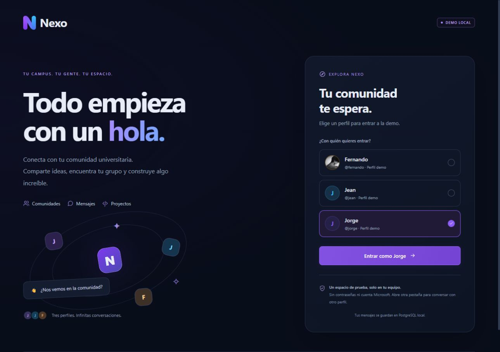
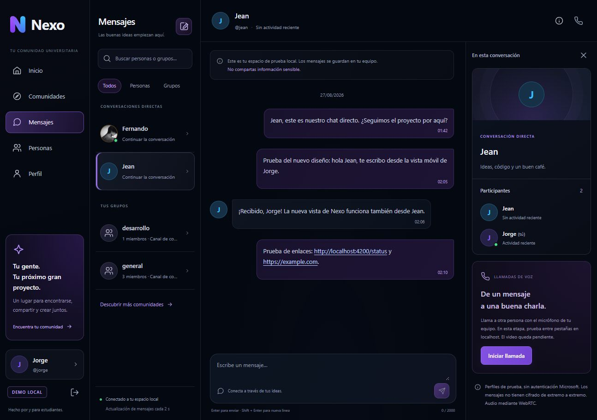
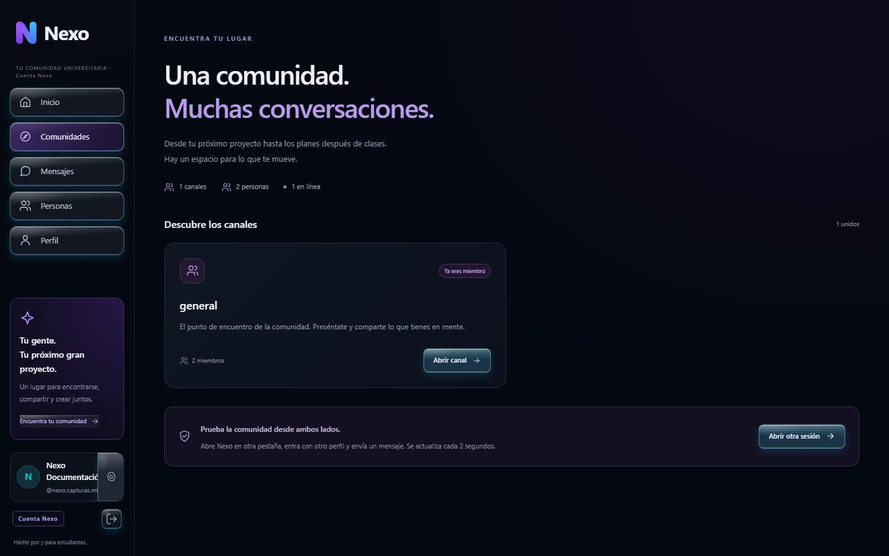
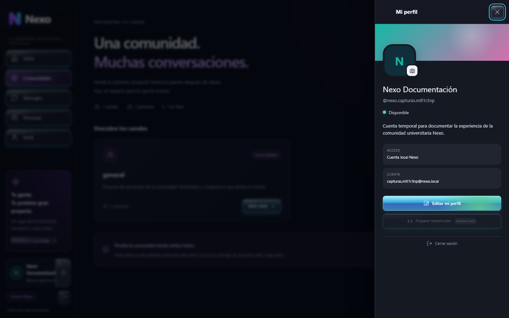
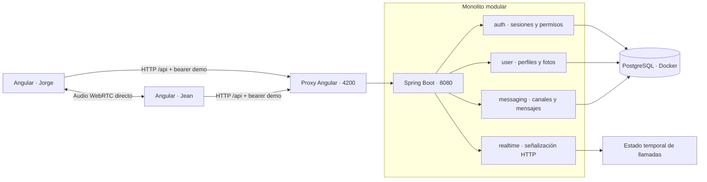
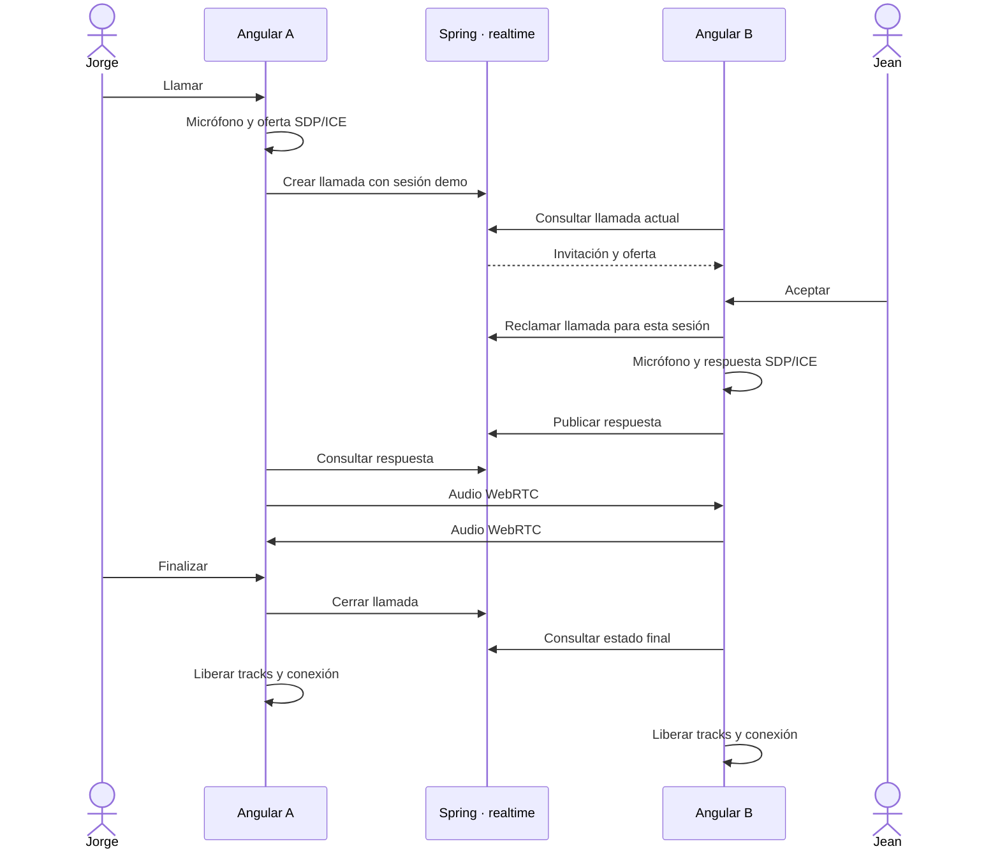
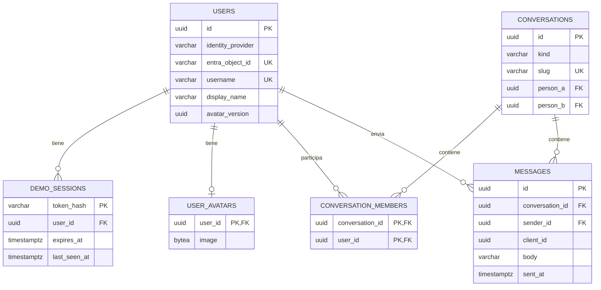

# Nexo · Comunidad universitaria

<p align="center">
  <br>
  <strong>Tu campus. Tu gente. Tu espacio.</strong><br>
  Proyecto de tesis · Prototipo funcional local
</p>

<p align="center">
  <a href="#producto">Producto</a> ·
  <a href="#arquitectura">Arquitectura</a> ·
  <a href="#instalacion">Instalación</a> ·
  <a href="#api">API</a> ·
  <a href="#pruebas">Pruebas</a> ·
  <a href="CONTRIBUTING.md">Contribuir</a>
</p>



> **Estado actual:** aplicación local con Angular, Spring Boot y PostgreSQL. Mantiene
> la demo multiusuario y añade registro/login local más integración Microsoft Entra ID
> mediante MSAL. La implementación y las pruebas automatizadas están completas; el
> login Microsoft real y el despliegue AWS requieren validación interactiva.

## Índice

- [Producto y capturas](#producto)
- [Alcance implementado](#alcance)
- [Stack y requisitos](#stack)
- [Arquitectura](#arquitectura)
- [Estructura del repositorio](#estructura)
- [Modelo de datos](#datos)
- [Ejecución local](#instalacion)
- [Guion de demostración](#demo)
- [API y errores](#api)
- [Seguridad y privacidad](#seguridad)
- [Pruebas y CI](#pruebas)
- [Git Pattern](#git-pattern)
- [Operación y solución de problemas](#operacion)
- [Próximas etapas](#roadmap)
- [Documentación y licencia](#documentacion)

<a id="producto"></a>
## Producto y capturas

Nexo organiza la experiencia alrededor de personas, conversaciones y comunidades
universitarias. Usa navegación con nombres, bandeja de conversaciones, burbujas de
mensajes y panel contextual. La identidad visual combina fondos oscuros, violeta
y azul; la interfaz admite teclado y adapta su disposición a móvil.

### Mensajería



Canales y conversaciones directas con texto persistente, enlaces navegables,
avatares y distinción entre mensajes propios y recibidos.

### Comunidades



Cuatro canales iniciales: `general`, `desarrollo`, `ideas-y-proyectos` y
`vida-universitaria`. Cada perfil puede consultar sus membresías, unirse y salir.

<details>
<summary><strong>Ver perfil y foto opcional</strong></summary>



La foto es opcional: seleccionar JPG/PNG, revisar la vista previa, guardar o
quitar la imagen para recuperar las iniciales.

</details>

Son capturas de la aplicación local real, no de funcionalidades futuras.
Los perfiles, mensajes y fotos visibles corresponden al entorno de demostración;
las imágenes no importan esos datos a una instalación nueva.
[Origen de las capturas](docs/images/README.md).

<a id="alcance"></a>
## Alcance implementado

| Área | Disponible | Límite actual |
| --- | --- | --- |
| Acceso | Demo, registro/login local y Microsoft Entra ID mediante MSAL | Login Microsoft real pendiente de evidencia interactiva |
| Navegación | Login, Inicio, Comunidades, Mensajes, Personas, Perfil y diagnóstico | Sin administración institucional |
| Canales | Descubrir, unirse, salir, ver participantes y conversar | Cuatro canales predefinidos; sin creación desde UI |
| Directos | Conversaciones entre dos perfiles con autorización backend | Sin grupos privados ni confirmaciones de lectura |
| Historial | PostgreSQL; envío idempotente mediante `clientId` | Últimos 100 mensajes, sin paginación |
| Enlaces | Reconoce `http://`, `https://` y `www.` | Sin previews ni verificación de reputación |
| Perfil | Foto opcional, validación, recorte y eliminación | Imágenes públicas dentro de la demo |
| Llamadas | Voz WebRTC, aceptar/rechazar, mute y finalizar | Dos usuarios; mismo equipo; sin video ni STUN/TURN |
| Presencia | Actividad reciente de sesiones | Polling HTTP; no hay WebSocket |
| Operación | Docker Compose, Flyway, health, Actuator y Swagger | Solo local, sin despliegue público |

<a id="stack"></a>
## Stack y requisitos

| Capa | Tecnología utilizada |
| --- | --- |
| Frontend | Angular 21.2, TypeScript 5.9, Tailwind CSS 4, RxJS 7.8 |
| Diseño Angular | Standalone Components, signals, Reactive Forms y rutas lazy |
| Voz | WebRTC del navegador y `getUserMedia` |
| Backend | Java 21, Spring Boot 3.5.16, Maven Wrapper 3.9.16 |
| API | Spring Web, Bean Validation, DTOs y errores uniformes |
| Seguridad | Spring Security, JWT local/Entra, scopes/roles y bearer demo aislado |
| Persistencia | PostgreSQL 17.10, JPA/Hibernate, JdbcClient y Flyway |
| Observabilidad | Actuator y springdoc OpenAPI 2.8.17 |
| Pruebas | JUnit 5, Spring Security Test, Testcontainers, Vitest y jsdom |
| Infraestructura | Docker Compose; backend Docker opcional |

Instalar **Node.js 24**, **npm 11**, **JDK 21** y **Docker Desktop con motor Linux**
o Docker Engine con Compose. Configurar `JAVA_HOME`. Angular CLI está incluido en
las dependencias: no necesita instalación global. Maven se descarga mediante el
wrapper; su distribución tiene checksum fijado en el repositorio.

Las versiones resueltas del frontend están en `frontend/package-lock.json`.
Usar `npm ci` para reproducirlas. La primera ejecución requiere Internet para
dependencias e imágenes; no necesita credenciales Microsoft.

<a id="arquitectura"></a>
## Arquitectura

**Monorepo y monolito modular:** una SPA Angular, una sola aplicación Spring Boot
y PostgreSQL. El backend está organizado por dominios, no por capas globales.
No hay microservicios ni un servidor adicional que transporte el audio.



### Responsabilidades y decisiones

- **auth:** crea credenciales opacas aleatorias de demo, valida expiración y
  revocación y entrega un principal al backend. No emite JWT.
- **user:** conserva perfiles y procesa fotos. JPA administra usuarios;
  JdbcClient guarda y consulta los bytes del avatar.
- **messaging:** conversaciones, miembros y mensajes. Consultas parametrizadas,
  transacciones y restricciones de base controlan permisos e idempotencia.
- **realtime:** intercambia SDP entre participantes autorizados. El audio viaja
  entre navegadores; la señalización temporal permanece en memoria del monolito.
- **common:** CORS, errores, health y OpenAPI.
- **Angular core:** sesión, guard, interceptor, clientes HTTP y voz; los componentes
  de página no duplican autenticación.

Los mensajes se consultan cada **2 s**, workspace cada **5 s** y señalización de
llamadas cada **1,5 s**. La presencia representa actividad en los últimos **45 s**.
WebSocket será una evolución posterior; estos intervalos no garantizan entrega instantánea.

### Ciclo de llamada



Solo la primera sesión del destinatario que acepta puede atender. Un usuario
ocupado no recibe otra llamada. Invitaciones y negociaciones vencen a los 45 s;
la ausencia de actividad también vence a los 45 s. La limpieza se evalúa al
atender peticiones. El permiso de micrófono pendiente tiene un límite de 30 s.

<a id="estructura"></a>
## Estructura del repositorio

```text
ProyectoTesis/
├── .github/
│   ├── workflows/ci.yml          # Frontend y backend
│   ├── ISSUE_TEMPLATE/           # Bugs y propuestas
│   ├── pull_request_template.md  # Cambio, pruebas y riesgos
│   └── CODEOWNERS                # Responsable de revisión
├── backend/
│   ├── .mvn/wrapper/             # Maven y checksum
│   ├── mvnw / mvnw.cmd
│   ├── pom.xml
│   ├── Dockerfile
│   ├── README.md
│   └── src/
│       ├── main/java/com/nexo/
│       │   ├── auth/             # config y demo
│       │   ├── user/             # controller/service/repository/entity/dto
│       │   ├── messaging/        # controller/service/repository/dto
│       │   ├── realtime/         # controller/service
│       │   ├── common/           # config/exception/health/response
│       │   └── NexoApplication.java
│       ├── main/resources/
│       │   ├── application.yml
│       │   ├── application-local-demo.yml
│       │   └── db/               # migration y demo
│       └── test/java/com/nexo/
├── frontend/
│   ├── public/                   # Recursos estáticos
│   ├── src/app/
│   │   ├── core/                 # auth/guards/interceptors/models/services/realtime
│   │   ├── shared/components/    # Avatar, iconos, enlaces y llamada
│   │   ├── features/             # auth/home/status
│   │   ├── app.config.ts
│   │   └── app.routes.ts
│   ├── src/environments/         # Valores públicos; nunca secretos
│   ├── angular.json
│   ├── package.json
│   ├── package-lock.json
│   └── proxy.conf.json
├── docs/
│   ├── images/                   # Capturas reales versionadas
│   ├── git-workflow.md           # Ramas, commits y GitHub
│   └── *verification.md          # Evidencia por etapa
├── scripts/verify-local.ps1
├── .editorconfig
├── .env.example
├── .gitattributes
├── .gitignore
├── .nvmrc
├── docker-compose.yml
├── CONTRIBUTING.md
├── SECURITY.md
└── README.md
```

Los tests Angular viven junto al código. No se versionan `.env`, dependencias
descargadas, volúmenes PostgreSQL, `target`, `dist` ni caches.

<a id="datos"></a>
## Modelo de datos



El diagrama resume campos y relaciones; las migraciones son la definición completa.
Los IDs son UUID. La pareja de usuarios de un directo se normaliza para impedir
duplicados. La clave única `(conversation_id, sender_id, client_id)` impide
duplicar un mensaje al reintentarlo.

| Migración | Propósito |
| --- | --- |
| V0 | Crear schema `nexo` |
| V1 | Usuarios locales, proveedor y campos preparados para Entra |
| V2 | Sesiones, conversaciones, miembros, mensajes e índices |
| V3 | Tres perfiles, cuatro canales y mensajes ficticios; solo `local-demo` |
| V4 | Fotos `bytea` y versión UUID |

Flyway guarda su historial en `public`; Hibernate usa `ddl-auto=validate`.
No editar migraciones aplicadas: agregar una nueva. Desactivar `local-demo` no
borra datos ya sembrados. La futura instalación real necesita una base limpia
y una transición de identidad revisada.

<a id="instalacion"></a>
## Ejecución local

### 1. Clonar y configurar

```bash
git clone https://github.com/JorgeVergaraS/ProyectoTesis.git
cd ProyectoTesis
```

Copiar `.env.example` a `.env` **solo si no existe**. Reemplazar `change-me`
por una contraseña local y usar el mismo valor en `POSTGRES_PASSWORD` y
`SPRING_DATASOURCE_PASSWORD`. Añadir para habilitar explícitamente la demo:

```env
SPRING_PROFILES_ACTIVE=local-demo
```

| Variable | Uso |
| --- | --- |
| `POSTGRES_DB`, `POSTGRES_USER` | Base y usuario; ejemplo `nexo` |
| `POSTGRES_PASSWORD` | Contraseña del contenedor; obligatoria, no versionada |
| `POSTGRES_PORT` | Puerto host de PostgreSQL; 5432 |
| `SPRING_DATASOURCE_URL` | `jdbc:postgresql://localhost:5432/nexo` |
| `SPRING_DATASOURCE_USERNAME`, `SPRING_DATASOURCE_PASSWORD` | Acceso JDBC del backend |
| `SPRING_PROFILES_ACTIVE` | `local-demo` habilita perfiles de prueba |
| `SERVER_PORT` | Puerto del backend local; 8080 |
| `CORS_ALLOWED_ORIGINS` | Origen permitido; `http://localhost:4200` |
| `AZURE_*` | Tenant, audience, JWK Set URI y scope públicos; nunca Client Secrets |

Spring importa `.env` desde la raíz al iniciar en `backend/`; las variables del
proceso tienen precedencia. Usar valores sin comillas compatibles con Java
Properties; una contraseña alfanumérica evita escapes. Si se cambia el puerto
de PostgreSQL, actualizar también JDBC.

### 2. PostgreSQL

```bash
docker compose up -d --wait
docker compose ps
```

Debe quedar `healthy`. El volumen `postgres_data` conserva la información.

### 3. Backend

PowerShell, desde la raíz:

```powershell
cd backend
.\mvnw.cmd spring-boot:run
```

Linux/macOS:

```bash
cd backend
./mvnw spring-boot:run
```

### 4. Frontend, en otra terminal

```bash
cd frontend
npm ci
npm start
```

En PowerShell puede usarse `npm.cmd` si se bloquea `npm.ps1`; no cambiar políticas
del equipo. `npx ng serve` equivale a `npm start`. Angular usa `apiUrl: '/api'`
y el proxy redirige a Spring en 8080. Los environments son públicos y no contienen
client secrets. Un build de producción no incluye un servidor/proxy: el futuro
hosting deberá configurarlos.

### URLs

| Recurso | URL |
| --- | --- |
| Acceso | [localhost:4200/login](http://localhost:4200/login) |
| Comunidad | [localhost:4200/home](http://localhost:4200/home) |
| Perfil | [localhost:4200/profile](http://localhost:4200/profile) |
| Diagnóstico | [localhost:4200/status](http://localhost:4200/status) |
| Health | [localhost:8080/api/public/health](http://localhost:8080/api/public/health) |
| Readiness + DB | [localhost:8080/actuator/health/readiness](http://localhost:8080/actuator/health/readiness) |
| Swagger | [localhost:8080/swagger-ui/index.html](http://localhost:8080/swagger-ui/index.html) |

### Backend en Docker, opcional

```bash
docker compose --profile app up -d --build --wait
```

Detener antes el backend local en 8080. Docker conecta Spring al host `postgres`,
espera el health de la base y ejecuta Java sin root. La imagen omite tests al
construirse: se ejecutan por separado con Maven/CI. Angular sigue con `ng serve`.
La verificación reciente de voz se hizo con Spring local, no con el contenedor backend.

<a id="demo"></a>
## Guion de demostración

1. Entrar como **Jorge**; abrir otra pestaña nueva en `/login` como **Jean**.
2. Abrir `general`, enviar un mensaje y comprobar su recepción sin recargar.
3. Explorar otro canal: cada perfil debe unirse para acceder.
4. Abrir un directo Jorge–Jean; Fernando no puede leerlo.
5. Enviar `https://example.com` y abrir el enlace desde el mensaje.
6. Ir a Perfil, elegir un JPG/PNG de hasta 2 MiB, guardar y comprobar el avatar.
7. En el directo, pulsar el teléfono; Jean recibe la invitación y acepta.
8. Permitir el micrófono, esperar **Audio conectado**, probar mute y finalizar.
9. Recargar para comprobar persistencia; cerrar sesión para bloquear las rutas privadas.

No usar **Duplicar pestaña**: algunos navegadores copian `sessionStorage`.
Crear una nueva o usar **Abrir otra sesión**, que emplea `noopener`. En móvil,
el menú superior abre navegación; participantes permite consultar el canal.

**Voz:** usar audífonos para evitar acople. Si se bloquea el autoplay, pulsar
**Activar audio recibido**. El micrófono del destinatario se solicita al aceptar.
El aviso entrante es visual; la llamada permanece al navegar entre rutas. No se graba.

ICE es local, sin STUN/TURN: verificado entre pestañas del mismo equipo, no entre
redes. El micrófono requiere un contexto seguro como localhost o HTTPS; una IP
por HTTP no es equivalente. Referencias:
[getUserMedia](https://developer.mozilla.org/en-US/docs/Web/API/MediaDevices/getUserMedia)
y [conectividad WebRTC](https://webrtc.org/getting-started/peer-connections).

<a id="api"></a>
## API y errores

Base local: `http://localhost:8080`. Swagger documenta los contratos. Las rutas
demo usan su credencial opaca; `/api/users/me` acepta JWT local o un Access Token
Entra válido con `access_as_user`.

| Método | Ruta | Acceso / comportamiento |
| --- | --- | --- |
| GET | `/api/public/health` | Público; estado básico |
| POST | `/api/auth/register` | Registro local; correo válido y contraseña de 8+ caracteres |
| POST | `/api/auth/login` | Login local; entrega JWT con issuer/audience propios |
| GET | `/api/users/me` | Perfil autenticado; exige `ROLE_USER` o `SCOPE_access_as_user` |
| GET | `/api/demo/users` | Público con demo; selector |
| POST | `/api/demo/sessions` | Público con demo; recibe `userId` |
| GET | `/api/demo/me` | Perfil de la sesión |
| DELETE | `/api/demo/sessions/current` | Revocar sesión propia |
| GET | `/api/demo/workspace` | Canales, directos y personas visibles |
| POST | `/api/demo/directs` | Abrir directo con destinatario `userId` |
| POST / DELETE | `/api/demo/conversations/{id}/membership` | Unirse / salir |
| GET | `/api/demo/conversations/{id}/members` | Participantes |
| GET / POST | `/api/demo/conversations/{id}/messages` | Consultar / enviar |
| POST / DELETE | `/api/demo/me/avatar` | Multipart `file` / quitar foto propia |
| GET | `/api/demo/avatars/{userId}/{version}` | PNG público de demo, versión vigente |
| GET | `/api/demo/calls/current` | Llamada de sesión; cuerpo vacío si no existe |
| POST | `/api/demo/calls` | Crear con `id`, `calleeId` y `offer` SDP |
| POST | `/api/demo/calls/{id}/accept` | Reclamar llamada para esta sesión |
| POST | `/api/demo/calls/{id}/answer` | Respuesta SDP del destinatario |
| POST | `/api/demo/calls/{id}/reject` | Rechazar invitación |
| POST | `/api/demo/calls/{id}/connected` | Informar conexión |
| POST | `/api/demo/calls/{id}/end` | Finalizar llamada propia |

Salvo las públicas, las rutas demo requieren `Authorization: Bearer <credencial_demo>`.
El remitente y propietario salen del principal validado, nunca de un `senderId`
elegido por el navegador.

Ejemplo de mensaje; generar un UUID por intención de envío:

```json
{
  "clientId": "00000000-0000-4000-8000-000000000001",
  "body": "Hola, comunidad. ¿Revisamos el proyecto?"
}
```

Para reintentar el mismo mensaje, conservar el `clientId`; para otro, generar uno nuevo.

Ejemplo de error, sin credenciales ni stack trace:

```json
{
  "timestamp": "2026-08-27T12:00:00Z",
  "status": 401,
  "error": "Unauthorized",
  "message": "Unauthorized",
  "path": "/api/demo/me"
}
```

| Código | Caso |
| --- | --- |
| 400 | Campos inválidos, texto vacío o SDP no admitido |
| 401 | Credencial ausente, inválida, expirada o revocada |
| 403 | Sesión válida sin permisos sobre el recurso |
| 404 | Recurso inexistente o versión antigua de avatar |
| 409 | Conflicto, por ejemplo participante ocupado |
| 413 / 415 | Imagen demasiado grande / formato o dimensiones inválidos |
| 429 | Límite de llamadas temporales |
| 503 | Base temporalmente no disponible |

<a id="seguridad"></a>
## Seguridad y privacidad

- Credenciales demo aleatorias de 256 bits, hash SHA-256 en PostgreSQL, expiración
  de 8 horas y revocación. No acreditan identidad personal.
- `sessionStorage` por pestaña; el interceptor solo adjunta el bearer a la API
  demo propia, nunca a enlaces externos de mensajes.
- Spring Security stateless, sin cookies de autenticación. La excepción CSRF está
  limitada a la API demo, que requiere cabeceras bearer explícitas.
- Autorización de membresía/participante en backend; ocultar botones o proteger
  rutas Angular no reemplaza esa autorización.
- CORS explícito para `http://localhost:4200`; servicios expuestos en loopback.
- Mensajes como texto y enlaces Angular, sin `innerHTML`; solo URLs web válidas,
  `target="_blank"` y `rel="noopener noreferrer"`.
- Avatares JPG/PNG reales: hasta 2 MiB, 4096 por lado y 16 millones de píxeles.
  Recorte al centro a hasta 512 px y recodificación PNG sin metadatos. Sin SVG.
  Reemplazar/quitar invalida la URL anterior.
- Fotos públicas para el selector demo. Los mensajes no tienen cifrado de extremo
  a extremo implementado.
- `local-demo` es opt-in y no puede combinarse con `prod` o `production`.
  Sin demo, el resto de rutas privadas se deniega. Esto no hace al proyecto
  apto para producción.

MSAL, Resource Server JWT, scopes/roles y `/api/users/me` están implementados.
El backend valida firma, issuer, audience, expiración y permiso; para identidades
Microsoft persiste `oid` sin guardar contraseña. La demo continúa separada mediante
el perfil `local-demo`. Leer [SECURITY.md](SECURITY.md).

<a id="pruebas"></a>
## Pruebas y CI

### Local

Backend con Docker iniciado:

```powershell
cd backend
.\mvnw.cmd verify
```

En Linux/macOS ejecutar `./mvnw verify` dentro de `backend/`.

Frontend:

```bash
cd frontend
npm run format:check
npm run test:ci
npm run build
```

Servicios iniciados, desde la raíz en PowerShell:

```powershell
.\scripts\verify-local.ps1
```

| Comprobación | Resultado registrado |
| --- | --- |
| Backend | 24 pruebas aprobadas, incluidas autenticación, 401/403/200 y Testcontainers |
| Frontend | 30 pruebas aprobadas en doce archivos |
| Build Angular | Compilación de producción correcta |
| Formato | Prettier correcto |
| Integración | Health, readiness DB, proxy, CORS y OpenAPI correctos |
| WebRTC real | Jorge–Jean: conectados, reproducción activa, mute y cierre |

Testcontainers crea bases efímeras, sin tocar la demo. Los tests unitarios de voz
usan dobles de medios; la conexión real se comprobó aparte. No se evaluó de oído
la calidad de voz ni se probaron redes remotas.
[Evidencia de fotos y llamadas](docs/photos-and-calls-verification.md).

### GitHub Actions

[CI](.github/workflows/ci.yml) define dos jobs en Ubuntu:
**Frontend** (instalación reproducible, formato, tests y build) y **Backend**
(Java 21, Maven Wrapper y Testcontainers). Se activa en pushes a `main`, pull
requests a `main` y manualmente. Actions fijadas por SHA y permiso `contents: read`.
No despliega ni necesita secretos de aplicación. El resultado remoto se consulta
en Actions; las pruebas locales no sustituyen una ejecución en GitHub.

<a id="git-pattern"></a>
## Git Pattern

Convención: **GitHub Flow + Conventional Commits**. `main` permanece verificable;
cada cambio se desarrolla en una rama corta, se revisa por pull request y se
integra tras pasar CI.

| Rama | Ejemplo / uso |
| --- | --- |
| `main` | Integración estable del prototipo |
| `feat/<tema>` | `feat/entra-login` |
| `fix/<tema>` | `fix/call-reconnection` |
| `docs/<tema>` | `docs/architecture` |
| `refactor/<tema>` | `refactor/messaging-service` |
| `test/<tema>` | `test/avatar-validation` |
| `chore/<tema>` | `chore/dependency-update` |

```text
feat(profile): permitir foto opcional de usuario
fix(realtime): descartar respuestas de una llamada cancelada
docs(readme): documentar arquitectura y ejecución local
test(messaging): verificar aislamiento de conversaciones
ci: validar Angular y Spring Boot
```

No se crean ramas vacías permanentes `develop` o `release` sin necesidad.
La guía detalla revisión, squash merge y protección manual de `main`.
**CODEOWNERS y la documentación no activan por sí solos las protecciones remotas.**
[Flujo completo](docs/git-workflow.md) · [Contribución](CONTRIBUTING.md).

Referencias: [GitHub Flow](https://docs.github.com/en/get-started/using-github/github-flow)
y [Conventional Commits](https://www.conventionalcommits.org/en/v1.0.0/).

<a id="operacion"></a>
## Operación y solución de problemas

| Problema | Revisar |
| --- | --- |
| No aparecen perfiles | Activar `local-demo`, reiniciar Spring y consultar health |
| Error PostgreSQL | Docker activo, contenedor healthy, contraseña y JDBC coincidentes |
| Puerto ocupado | No duplicar backend en 8080; revisar 4200 y 5432 |
| 401 después de varias horas | Sesión vencida; volver a seleccionar perfil |
| No se ve un canal | El usuario debe unirse; permisos aplicados por servidor |
| Mensajes no instantáneos | Polling de 2 s, conexión y membresía |
| Sin micrófono | Permisos del navegador y localhost/HTTPS |
| Conectado pero sin sonido | Dispositivo, mute, audífonos y activar audio recibido |
| Falla entre dispositivos | Fuera del alcance verificado; falta STUN/TURN y hosting seguro |
| Foto rechazada | JPG/PNG válido dentro de límites de tamaño y dimensiones |
| `npm.ps1` bloqueado | Usar `npm.cmd`, no cambiar políticas del equipo |
| Testcontainers no inicia | Motor Docker Linux activo y accesible |

Detener Angular/Spring con Ctrl+C. `docker compose stop` detiene PostgreSQL.
`docker compose down` conserva el volumen; **`down -v` borra la base** y no es
parte del arranque normal. Cambiar `.env` no rota la contraseña de un volumen
existente. No subir backups, secretos, tokens o logs privados.

Cerrar/recargar una pestaña o reiniciar Spring interrumpe las llamadas. Los
borradores viven en memoria; fotos e historial enviado persisten. Si logout no
llega al servidor se elimina la sesión local y se informa que la credencial
remota vencerá, como máximo, en ocho horas.

<a id="roadmap"></a>
## Próximas etapas

- [x] Angular → Spring Boot → PostgreSQL local.
- [x] Monolito modular, Flyway, health y Swagger.
- [x] Comunidad y mensajería con perfiles demo independientes.
- [x] Diseño Nexo, rutas privadas, enlaces y foto de perfil.
- [x] Voz WebRTC entre usuarios del mismo equipo.
- [x] Pruebas locales y definición del workflow CI.
- [x] Microsoft Entra ID y MSAL implementados en código.
- [x] Resource Server: firma, issuer, audience, expiración, scopes y roles JWT.
- [x] Sincronización Microsoft mediante `/api/users/me` sin contraseña.
- [ ] Validación interactiva del login/logout Microsoft real en Brave.
- [ ] Backend en EC2 y publicación mediante HTTP API Gateway con JWT Authorizer.
- [ ] WebSocket autenticado y presencia persistente.
- [ ] STUN/TURN, HTTPS y pruebas entre dispositivos/redes.
- [ ] Video, grupos y adjuntos según el alcance aprobado.
- [ ] Paginación, límites, observabilidad y revisión para despliegue real.

No hay fechas comprometidas ni se presentan estas etapas como disponibles.
Redis, coturn e infraestructura adicional se incorporarán solo cuando se utilicen.

<a id="documentacion"></a>
## Documentación y licencia

- [Backend](backend/README.md) y [frontend](frontend/README.md).
- [Git Pattern y GitHub](docs/git-workflow.md).
- [Contribución](CONTRIBUTING.md) y [seguridad](SECURITY.md).
- [Verificación actual de fotos y voz](docs/photos-and-calls-verification.md).
- Evidencia histórica: [fundación](docs/verification.md),
  [demo multiusuario](docs/local-demo-verification.md) y
  [rediseño](docs/visual-redesign-verification.md). Cada informe refleja su etapa.

Repositorio: [JorgeVergaraS/ProyectoTesis](https://github.com/JorgeVergaraS/ProyectoTesis).
No se ha definido una licencia de distribución del código del proyecto.
Las dependencias conservan sus respectivas licencias.
