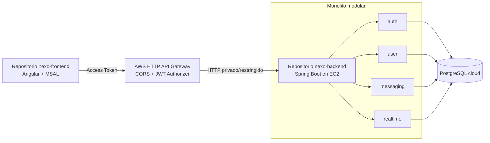

# ADR-001: monolito modular y repositorios separados

- Estado: aceptado por el equipo
- Fecha: 2 de septiembre de 2026
- Alcance: arquitectura de aplicación y estrategia de repositorios

## Contexto

La pauta oficial utiliza Pedidos360 como referencia y solicita Angular con MSAL,
Spring Boot, JWT, API Gateway, EC2 y base de datos cloud. También menciona
microservicios. Nexo ya posee una aplicación Spring Boot organizada por dominios
(`auth`, `user`, `messaging`, `realtime` y `common`) y una SPA Angular independiente.

El equipo decide conservar un **monolito modular** para evitar coordinación
distribuida innecesaria mientras el producto y el equipo son pequeños. Esta
decisión no cambia por alojar frontend y backend en repositorios diferentes.

## Decisión

La entrega se organizará en dos repositorios:

| Repositorio | Contenido | Unidad desplegable |
| --- | --- | --- |
| [`ProyectoTesis`](https://github.com/JorgeVergaraS/ProyectoTesis) | Angular, MSAL, guards, interceptores, vistas y tests | archivos estáticos de la SPA |
| [`ProyectoTesisBackend`](https://github.com/JorgeVergaraS/ProyectoTesisBackend) | una aplicación Spring Boot, migraciones y tests | un artefacto JAR / una instancia EC2 |

El backend seguirá siendo una sola aplicación y una sola unidad de despliegue,
pero sus módulos tendrán límites explícitos por dominio. Los controladores y DTO
son la frontera HTTP; ningún módulo expone entidades JPA como contrato externo.



## Reglas de modularidad

1. Los paquetes de primer nivel representan dominios, no capas globales.
2. `common` solo contiene infraestructura transversal; no lógica de negocio.
3. Un módulo accede a otro mediante servicios o contratos públicos, no mediante
   tablas o repositorios internos ajenos.
4. Las migraciones siguen siendo propiedad del backend y son inmutables una vez aplicadas.
5. La identidad se deriva del JWT validado. El frontend nunca elige el usuario
   efectivo ni envía roles confiables.
6. La autorización se aplica en API Gateway como primera barrera y nuevamente en Spring.
7. El perfil `local-demo` no se habilita en AWS.

## Consecuencias

Ventajas: despliegue simple, transacciones locales, una sola configuración de
seguridad, menor costo y posibilidad de extraer módulos posteriormente. Costos:
la aplicación escala como una unidad y una falla puede afectar todos los dominios.

**Riesgo académico:** dos repositorios no convierten el backend en microservicios.
Como la pauta menciona explícitamente microservicios, esta desviación debe quedar
aprobada por el docente. Hasta obtener esa aprobación, no se afirmará que el punto
de microservicios está cumplido. Si se exige más de una unidad desplegable, el
primer candidato de extracción será `realtime` o `messaging`, manteniendo `auth`
y `user` en el backend principal.

## Estrategia de separación

Primero se integran y prueban frontend y backend en el monorepo de trabajo. Después
se crean los repositorios de entrega mediante historia filtrada, no copiando
archivos manualmente:

```bash
git subtree split --prefix=frontend -b export/frontend
git subtree split --prefix=backend -b export/backend
```

Cada rama se publica en un repositorio vacío. Los archivos raíz compartidos
(`README`, CI, seguridad y ejemplos de variables) se adaptan en cada repositorio.
El monorepo puede mantenerse como integración y documentación, pero no se usará
como fuente ambigua durante la defensa.

## Criterios para revisar la decisión

- El docente exige al menos dos servicios Spring Boot desplegados.
- Un módulo necesita escalar, desplegarse o aislar fallos independientemente.
- El equipo puede asumir observabilidad, versionado de contratos y operación distribuida.
- Una frontera de dominio demuestra suficiente estabilidad para ser extraída.
