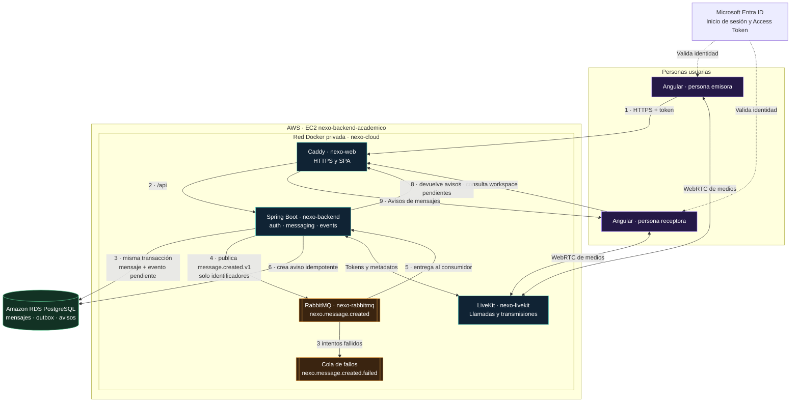

# Arquitectura de RabbitMQ para avisos de mensajes

- Estado: implementada y desplegada
- Fecha: 25 de septiembre de 2026
- Alcance: mensajería asíncrona y avisos persistentes

## Diagrama de arquitectura



## Cómo se representa

| Forma o línea | Significado |
| --- | --- |
| Rectángulos morados | Navegadores Angular de las personas usuarias |
| Rectángulos azules | Servicios que se ejecutan en EC2 |
| Figuras naranjas | Cola principal y cola de fallos de RabbitMQ |
| Cilindro verde | Datos persistentes en Amazon RDS |
| Flechas continuas numeradas | Recorrido real de un mensaje y su aviso |
| Flechas punteadas | Autenticación externa mediante Microsoft Entra |
| Marco `nexo-cloud` | Red Docker privada; RabbitMQ no tiene puertos públicos |

Los números muestran el orden lógico. La respuesta HTTP del mensaje puede finalizar
después del paso 3: la creación del aviso continúa de forma asíncrona en los pasos
4 a 6. La persona receptora lo ve cuando Angular actualiza el workspace.

## Qué representa cada almacenamiento

```text
PostgreSQL / RDS
├── messages                 mensaje definitivo del chat
├── message_outbox           evento pendiente de publicar
└── message_notifications    aviso persistente de cada destinatario

RabbitMQ
├── nexo.message.created           eventos listos para el consumidor
└── nexo.message.created.failed    eventos que agotaron los reintentos
```

RabbitMQ transporta el trabajo; RDS conserva el estado del producto. Por eso un
reinicio del consumidor no elimina mensajes ni avisos, y una caída temporal del
broker no obliga a rechazar el mensaje del chat.

## Relación con la interfaz


El bloque **Avisos de mensajes** es la representación visible del resultado. La
interfaz no se conecta directamente al broker: consulta al backend, que lee
`message_notifications`, comprueba membresía y devuelve únicamente los avisos de
la identidad autenticada.

La explicación funcional y el guion de demostración están en
[RabbitMQ en Nexo: explicación y evidencia visual](../rabbitmq-explicacion-evidencia.md).
La configuración, recuperación y pruebas están en
[RabbitMQ aplicado a Nexo](../rabbitmq-en-nexo.md).
