# Despliegue cloud: bitácora y criterios de aceptación

Fecha: 8 de septiembre de 2026. Rama: `feat/despliegue-cloud`.

Actualización de alcance: el usuario solicita una entrega académica de bajo costo,
sin dominio propio, con Docker en EC2 y PostgreSQL en RDS. Ver
[diseño EP1 y matriz de evidencia](entrega-ep1-academica.md). RDS también fue
inspeccionado en Chrome: cero bases de datos en `us-east-1`.

## Inspección realizada

- AWS: acceso interactivo confirmado en Chrome, región `us-east-1`.
- Sesión de laboratorio `voclabs`. La tabla EC2 informa que no existen
  instancias en la región. Se abrió el formulario de lanzamiento; no se lanzó
  ninguna instancia ni se modificaron reglas de red.
- Azure: sesión de Brave recuperada en el tenant del proyecto. Se verificaron
  los dos registros, el redirect SPA y la preautorización del scope de la API.
- Login Microsoft, restauración de sesión, perfil HTTP 200 y logout comprobados
  en Brave contra el backend local. No acreditan aún el despliegue cloud.
- Presupuesto comunicado: USD 50 del laboratorio. Presentación viernes 11 y
  disponibilidad para sesiones hasta domingo 13. Sin dominio propio.
- RDS: formulario preparado con PostgreSQL 17.10-R1, `db.t4g.micro`, Single-AZ,
  20 GiB y acceso público desactivado. Posteriormente se creó mediante el flujo
  de creación sencilla; ver la evidencia y las salvedades siguientes.

## Creación académica de PostgreSQL en RDS

Con autorización expresa del propietario se utilizó **Creación sencilla** con
PostgreSQL, tamaño **Capa gratuita**, instancia `db.t4g.micro`, 1 GiB de RAM y
20 GiB de almacenamiento. El identificador es `nexo-academico-db` y el usuario
maestro es `nexo_admin`.

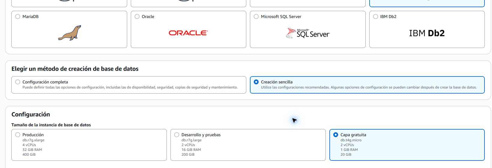

AWS aceptó la operación y mostró la instancia con estado **Creando**, motor
PostgreSQL, tamaño `db.t4g.micro`, una sola zona de disponibilidad y Multi-AZ
desactivado.

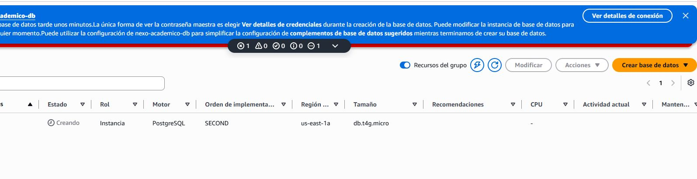

La consola generó una contraseña maestra y advierte que solo puede verse una
vez. Se dejó el modal abierto para que el propietario la guarde directamente;
la contraseña no se leyó, copió, registró ni capturó. Tampoco debe incorporarse
al repositorio. Antes de conectar el backend falta verificar el endpoint, la
disponibilidad final y las reglas de red creadas por el modo sencillo.

## Evidencia de Azure y login: 8 de septiembre

1. En Brave, abrir Azure y verificar el directorio que coincide con el tenant
   configurado en Nexo.
2. Entrar en **App registrations → All applications** y buscar `Nexo`.
   Se encontraron `Nexo Frontend` y `Nexo Web` con los IDs del repositorio.

   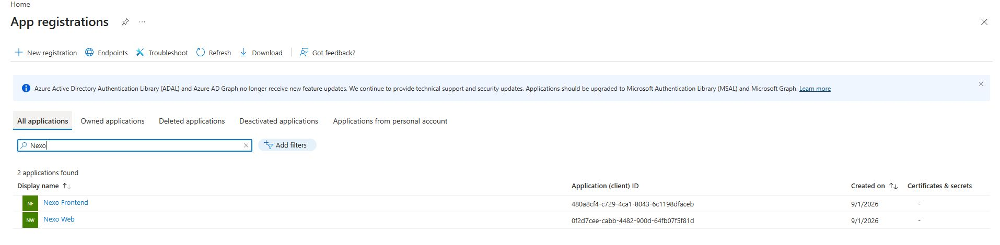

3. Abrir **Nexo Frontend → Authentication**. Se verificó una plataforma SPA
   con `http://localhost:4200`.

   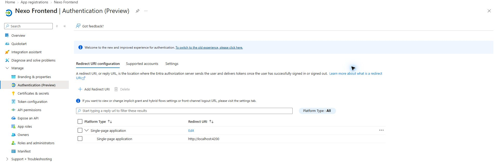

4. En **API permissions**, el listado estático muestra Microsoft Graph
   `User.Read`. Esto por sí solo no prueba que el scope de Nexo sea inaccesible;
   se inspeccionó también la preautorización en la aplicación API.

   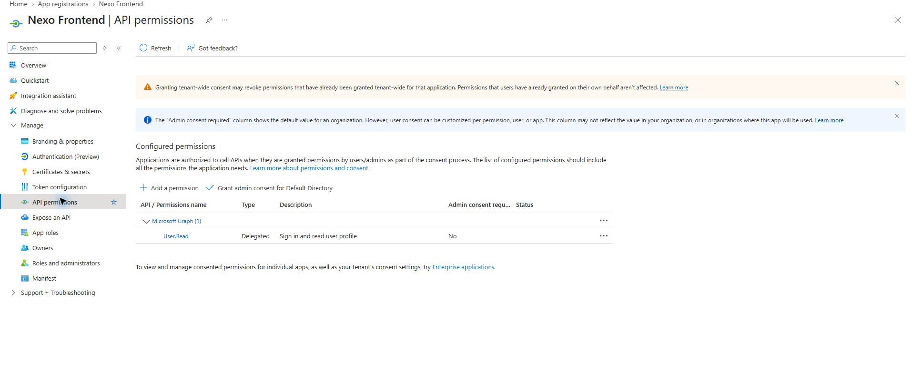

5. Abrir **Nexo Web → Expose an API**. Se verificó `access_as_user` habilitado,
   consentimiento de administradores y el ID del frontend entre los clientes
   autorizados, con un scope. No se modificaron permisos ni consentimientos.

   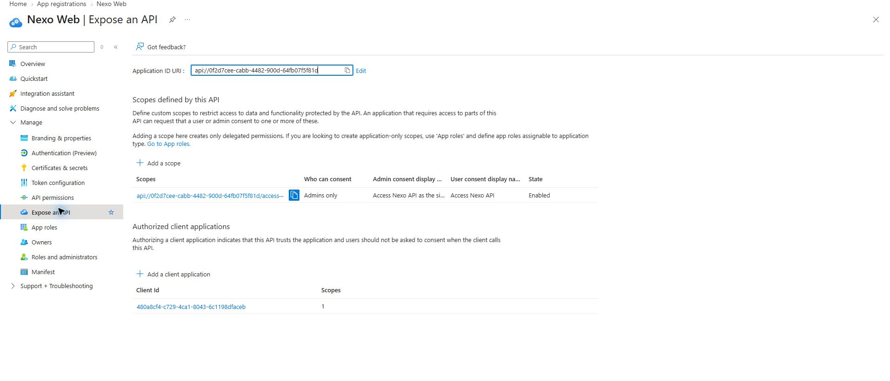

6. Iniciar backend y Angular locales. Readiness respondió `UP`. Abrir Nexo en
   Brave y pulsar **Continuar con Microsoft**. La redirección usa el tenant,
   client ID, scope y redirect correctos y solicita Authorization Code con PKCE.
   El usuario completó personalmente el selector de cuentas Microsoft.
7. Nexo volvió a `/home` y mostró acceso **Microsoft Entra ID**. Después de
   recargar, se observó `/api/users/me` con HTTP **200** en la red del navegador,
   sin registrar cabeceras, tokens ni cuerpo de respuesta. La sesión se restauró.
8. Abrir `/profile` y pulsar **Cerrar sesión**. Microsoft mostró
   **You signed out of your account**. En esta prueba quedó en la página de
   Microsoft; no se acredita retorno automático a Nexo.
9. Navegar manualmente a `http://localhost:4200/profile`: Nexo redirigió a
   `/login`, sin mostrar el perfil. La captura siguiente documenta la pantalla
   pública resultante; no expone datos personales ni credenciales.

   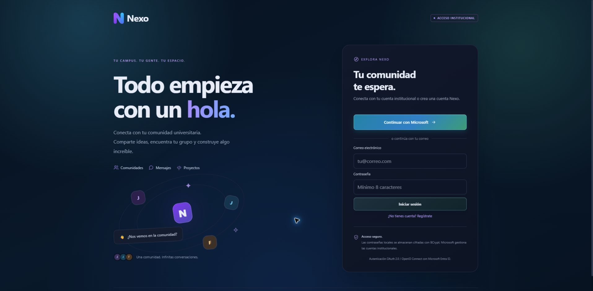

Resultado local: login, restauración y cierre de sesión correctos para la cuenta
probada. Pendientes: otras cuentas/roles, errores de autorización, expiración,
retorno automático tras logout y repetir la matriz contra API Gateway y EC2.

## Incorporación de cuenta institucional Duoc por B2B

El intento inicial con la cuenta institucional falló porque `Nexo Frontend` es
single-tenant y la identidad no existía en **Default Directory**. Se eligió la
alternativa de colaboración B2B para conservar el diseño single-tenant de la
entrega y evitar cambios de issuer en el backend.

1. En **Microsoft Entra ID → Users**, seleccionar **New user → Invite external
   user**.
2. Registrar la cuenta institucional como usuario tipo **Guest**, mantener el
   mensaje de invitación y revisar el tenant de destino.
3. Con confirmación expresa del propietario, seleccionar **Invite**. Azure
   respondió **Successfully invited user** y el listado mostró el origen
   **Invitation**.

   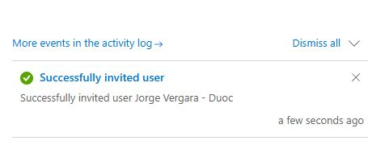

4. Se detectó que la primera dirección no incluía la `s` final del nombre de
   usuario. Con una segunda confirmación expresa, se eliminó ese invitado y se
   creó uno nuevo para `jor.vergaras@duocuc.cl`. Azure confirmó ambas operaciones
   y la búsqueda exacta mostró el nuevo registro como **Guest**, con creación
   **Invitation**. No se publica la vista completa porque contiene direcciones
   de correo y el identificador interno del usuario.

La evidencia gráfica publicada omite el correo completo y la cabecera de la cuenta
del portal.

## Validación de acceso con cuenta Duoc

El usuario aceptó personalmente la invitación B2B e inició sesión con su cuenta
institucional. Nexo abrió `/home`, mostró el nombre institucional y señaló el
acceso **Microsoft Entra ID**. Se navegó a `/profile` correctamente.

Después de recargar la aplicación, la solicitud protegida `/api/users/me`
respondió HTTP **200**. La observación registró únicamente URL y estado; no se
leyeron ni almacenaron JWT, cabeceras o cuerpo de respuesta.

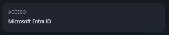

Resultado: login B2B, persistencia de sesión y acceso al perfil protegidos
aprobados en el entorno local. El logout ya fue validado anteriormente con otra
cuenta Entra. Falta repetir toda la matriz contra EC2 y API Gateway; la evidencia
actual no acredita todavía un backend cloud.

Las capturas guardadas omiten la cabecera de cuenta Azure. El backend iniciado
para esta prueba usa el perfil local existente; esta ejecución no es un despliegue
cloud ni una validación del perfil de producción.

## Configuración encontrada en el repositorio

Estos valores públicos provienen del código; no acreditan la configuración
actual del portal Azure:

| Parámetro | Valor |
| --- | --- |
| Tenant | `21a4bbb2-fc48-4053-a98e-b805aa2306cc` |
| Aplicación SPA | `480a8cf4-c729-4ca1-8043-6c1198dfaceb` |
| Aplicación API | `0f2d7cee-cabb-4482-900d-64fb07f5f81d` |
| Permiso delegado | `access_as_user` |
| Redirect local | `http://localhost:4200` |
| Issuer v2 | `https://login.microsoftonline.com/21a4bbb2-fc48-4053-a98e-b805aa2306cc/v2.0` |

Spring valida tokens Entra y tokens locales. La configuración admite también
un issuer Entra legado; hay que comprobar la versión del access token real
antes de configurar el authorizer. No registrar tokens completos.

## Secuencia de implementación y prueba

1. Azure: comprobar tenant, registros SPA/API, redirect SPA, versión del access
   token y permiso delegado. Probar login, `/api/users/me` y logout en Brave.
2. EC2: concretar tipo, almacenamiento, presupuesto, acceso administrativo y
   red. Preparar instalación reproducible y secretos independientes del PC.
   Desplegar sin `local-demo`; no copiar la base local.
3. API: preparar integración HTTP API Gateway, authorizer Entra y rutas con
   scopes explícitos. Probar 401 sin token, 401 inválido, 403 sin permiso y
   200 con permiso. Comprobar CORS y que no se eluda el control por acceso
   directo al backend.
4. Tiempo real: implementar WebSocket autenticado y presencia persistente,
   con expiración, reconexión y comprobación de membresía. Diseñar su entrada
   pública por separado de la API HTTP.
5. Multimedia: configurar HTTPS/WSS y TURN con el dominio acordado. Validar
   eventos firmados, repetidos y fuera de orden, y revocar participantes al
   perder membresía, incluyendo intentos de volver con un token anterior.
6. Alcance funcional: contrastar grupos privados y adjuntos con el alcance
   aprobado antes de elegir permisos, tipos de archivo y almacenamiento.
7. Operación: fijar paginación y límites, métricas sin contenido privado,
   retención de logs, restauración y procedimiento de reversión.
8. Dos dispositivos y redes diferentes: comprobar audio/video, candidato
   relay, pérdida de red y reconexión; registrar navegador y resultado real.

## Infraestructura AWS creada

### PostgreSQL en Amazon RDS

Se creó `nexo-academico-db` mediante **Creación sencilla**, con PostgreSQL
17.10, clase `db.t4g.micro`, 20 GiB, una zona de disponibilidad y sin Multi-AZ.
La consola confirmó el estado **Disponible** el 8 de septiembre de 2026.

La base no tiene puerta de enlace a Internet y no es públicamente accesible.
Usa el puerto PostgreSQL 5432 y, al momento de la verificación, el grupo de
seguridad predeterminado solo aceptaba entrada desde el mismo grupo. El endpoint
y la contraseña maestra no se publican en este documento. La contraseña fue
guardada personalmente por el propietario del laboratorio.

Pendiente inmediato: autorizar PostgreSQL únicamente desde el grupo de seguridad
de la VPS y probar una conexión real desde esa instancia.

El 8 de septiembre se completó ese pendiente mediante el asistente de conexión
EC2–RDS. AWS creó los grupos `ec2-rds-1` y `rds-ec2-1`; la base admite PostgreSQL
desde el grupo de la VPS, no desde Internet. El backend abrió una conexión Hikari
y Flyway aplicó correctamente las diez migraciones hasta V10 sobre PostgreSQL
17.10.

### VPS económica en Amazon EC2

Se lanzó una instancia llamada `nexo-backend-academico` con esta configuración:

- Amazon Linux 2023 x86_64.
- `t3.micro`: 2 vCPU y 1 GiB de memoria, apta para capa gratuita.
- Un volumen raíz gp3 de 8 GiB.
- Créditos de CPU en modo `standard`, evitando el consumo adicional del modo
  ilimitado.
- Perfil `LabInstanceProfile`/rol `LabRole` y par de claves `vockey` provistos
  por AWS Academy.
- IMDSv2 obligatorio y monitoreo detallado desactivado.
- IP pública automática; puede cambiar al detener o reiniciar el laboratorio.
- SSH limitado a la IP pública actual del estudiante y HTTP habilitado para la
  demostración académica. Si cambia de red, debe actualizarse la regla SSH.

Los datos de usuario instalan Docker y Git, habilitan Docker al iniciar y crean
`/opt/nexo`. No contienen secretos. La consola confirmó el lanzamiento y luego
mostró la instancia **En ejecución**. No se publica el ID, la IP ni el DNS de la
instancia para evitar exponer identificadores de infraestructura.

Esta VPS es adecuada para una entrega básica de bajo costo. Su 1 GiB de memoria
obliga a medir el consumo antes de ejecutar simultáneamente Spring Boot,
LiveKit y otros contenedores; si no alcanza, se debe separar LiveKit o cambiar
temporalmente el tamaño durante las pruebas.

Para sostener la compilación sin aumentar la clase de instancia se habilitó un
archivo swap de 2 GiB. El repositorio se clonó temporalmente mientras su
propietario lo hizo público y volvió a quedar privado al terminar. En la VPS se
construyó `nexo-backend:cloud`; el contenedor usa `restart: always`, publica 8080
solo en loopback y carga un archivo de entorno con permisos 600. La contraseña
RDS fue ingresada directamente por el propietario y no se leyó ni registró.

Pruebas observadas desde la VPS y desde un equipo externo:

| Comprobación | Resultado |
| --- | --- |
| Contenedor backend | En ejecución |
| Flyway | 10 migraciones aplicadas, versión V10 |
| Readiness interno | HTTP 200, `UP` |
| Health público vía proxy | HTTP 200, `nexo-backend` `UP` |
| Ruta privada sin JWT | HTTP 401, acceso rechazado correctamente |
| Navegación directa SPA (`/profile`) | HTTP 200, fallback de Angular correcto |
| Angular | Compilación de producción correcta |

### HTTPS y nombre temporal

La SPA inicializaba MSAL y no podía arrancar correctamente sobre una IP por HTTP,
porque las API criptográficas del navegador y los redirects remotos de Entra
requieren un contexto seguro. Para la entrega se configuró Caddy con certificado
automático de Let's Encrypt y un nombre DNS dinámico de `nip.io` que codifica la
IP pública. El grupo de seguridad expone únicamente HTTP 80 y HTTPS 443 para la
web; SSH permanece limitado a la IP del estudiante y RDS continúa privada.

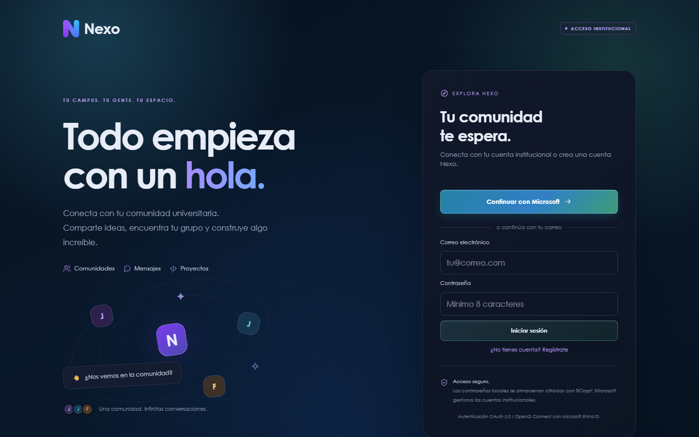

La URL concreta se omite de este documento porque cambia con la IP pública. El
redirect HTTPS se registró como plataforma **Single-page application** en `Nexo
Frontend`, conservando también `http://localhost:4200`. La URL temporal dura
mientras `nip.io` continúe resolviendo y la EC2 conserve su IP. AWS Academy puede
detener la instancia al finalizar una sesión; un nuevo arranque puede asignar
otra IP y exigir regenerar el nombre, el certificado, CORS y el redirect Entra.
Los contenedores y el certificado persisten en el volumen de la VPS y tienen
reinicio automático.

## Estado de aceptación

El punto de autenticación tiene evidencia interactiva local descrita arriba.
RDS, la VPS, el backend, la SPA y HTTPS están operativos. Se verificaron HTTP 200
para Angular y health mediante el proxy, y la conexión real de Spring a RDS.
Todavía no están acreditados API Gateway con authorizer, WebSocket persistente,
TURN, LiveKit cloud ni pruebas multimedia entre redes. La validación de login
Microsoft cloud debe completarse interactivamente desde el navegador.

### Multimedia entre redes

El 8 de septiembre se desplegó `livekit/livekit-server:v1.13.6` como contenedor
`nexo-livekit`, unido a la red Docker del backend y con reinicio automático. Las
claves se generaron dentro de la VPS, permanecen en archivos con permisos
restringidos y no forman parte del repositorio ni de las capturas.

La señalización se publica mediante Caddy en un subdominio HTTPS temporal y el
backend entrega esa dirección como `wss://`. Se habilitaron únicamente estos
puertos de medios en `launch-wizard-1`:

| Protocolo | Puerto | Uso |
| --- | ---: | --- |
| TCP | 7881 | ICE/WebRTC cuando UDP no está disponible |
| UDP | 7882 | Transporte principal de audio y video de LiveKit |
| UDP | 3478 | STUN/TURN UDP integrado de LiveKit |

AWS confirmó seis reglas de entrada totales. Después de guardar las reglas,
LiveKit descubrió mediante STUN la IP pública de la EC2 y registró `using
external IPs`, sin volver a mostrar el error de validación observado cuando UDP
estaba bloqueado. Desde un equipo externo se verificaron TCP 7881 accesible,
HTTPS 200 para el endpoint LiveKit y HTTP 200/`UP` para Spring.

El cliente de llamadas dejó de usar `iceServers: []` y ahora incluye un servidor
STUN configurable. Sus 76 pruebas unitarias pasan. Esto permite candidatos ICE
externos, aunque una llamada P2P en una red con NAT simétrico todavía puede
requerir un TURN específico con credenciales temporales; el TURN integrado de
LiveKit protege las transmisiones LiveKit, no sustituye automáticamente el relay
de la llamada P2P independiente.

La captura reportada antes del cambio mostraba correctamente la causa: el estudio
solo ofrecía vista previa porque `NEXO_BROADCASTS_ENABLED` estaba desactivado.

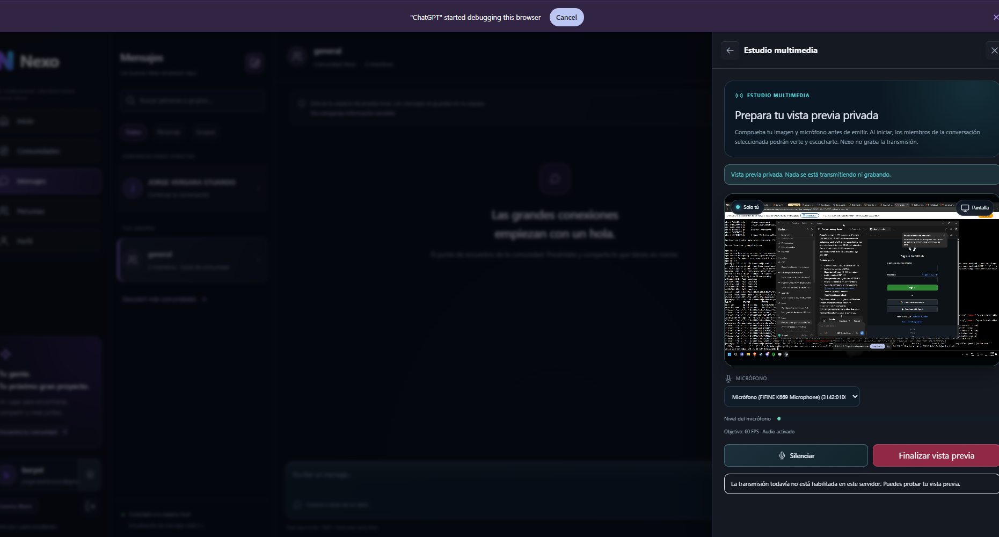

Tras el despliegue, una sesión Microsoft autenticada abrió el estudio sin ese
aviso y mostró cámara/pantalla, audio y selector de 15/30/60 FPS. Falta capturar
la prueba funcional de extremo a extremo con un anfitrión en PC y un espectador
en celular; no se declara aprobada hasta observar imagen y audio en ambos lados.

El 8 de septiembre, una prueba PC–celular permaneció en `Conectando audio`; esto
confirmó que STUN no bastaba para la llamada P2P. Se desplegó `nexo-turn` con
Coturn, autenticación obligatoria, reinicio automático y credenciales aleatorias
generadas dentro de EC2. Se habilitaron TCP/UDP 3479 y el rango UDP reducido
49160–49200. El frontend cloud utiliza TURN por UDP y TCP; la credencial es
temporal y debe rotarse al finalizar la demostración.

También se corrigió la captura de pantalla: ahora solicita audio del sistema,
conserva simultáneamente la pista del micrófono y publica el audio del escritorio
como `screen_share_audio`. El usuario debe marcar **Compartir audio** en el
selector del navegador; algunos navegadores solo lo ofrecen al compartir una
pestaña o la pantalla completa. Las 76 pruebas frontend permanecen aprobadas.

### Compatibilidad de llamadas y transmisión

La validación objetivo cubre navegadores modernos con WebRTC: Chrome y Edge en
Windows/Android, Firefox en Windows/Android y Safari en macOS/iOS. Nexo debe
abrirse mediante HTTPS y el usuario debe conceder permiso de micrófono. En iPhone
y iPad todos los navegadores utilizan el motor WebKit de iOS, por lo que su
comportamiento multimedia depende de la versión de iOS aunque se abra Chrome,
Edge o Firefox.

No es técnicamente correcto prometer compatibilidad con *todos* los dispositivos
y navegadores. Quedan fuera navegadores antiguos, navegadores integrados dentro
de otras aplicaciones, equipos sin WebRTC y dispositivos o redes con políticas
que bloqueen cámara, micrófono o TURN. Para redes móviles y NAT restrictivo se
usa TURN como relay; STUN queda como ruta directa preferida.

El audio del sistema depende además del selector nativo de captura. Chrome y
Edge de escritorio permiten incluirlo para pestañas y, según el sistema
operativo, para pantalla completa. Los navegadores móviles normalmente no
permiten capturar pantalla con audio del sistema desde una página web. El
micrófono se publica como pista separada cuando el navegador lo autoriza.

#### Prueba cruzada mínima

1. Abrir la URL pública en una ventana limpia de PC y en un teléfono conectado a
   datos móviles, usando dos cuentas distintas.
2. Conceder permiso de micrófono en ambos equipos e iniciar una llamada.
3. Confirmar audio bidireccional, silenciamiento y finalización.
4. Iniciar una transmisión desde escritorio, marcar **Compartir audio** en el
   selector y comprobar imagen y sonido desde el teléfono.
5. Repetir en Chrome/Edge de escritorio y Chrome/Safari móvil, anotando versión,
   red, resultado y evidencia.

#### Incidencia: llamadas iniciadas en conversaciones diferentes

La prueba del 8 de septiembre aportó dos capturas con `Conectando audio`. La
evidencia permitió comprobar que los paneles no representaban una misma sesión:
en el PC estaba seleccionada la conversación grupal **general**, mientras que en
el teléfono estaba seleccionada la conversación directa **boryot**.

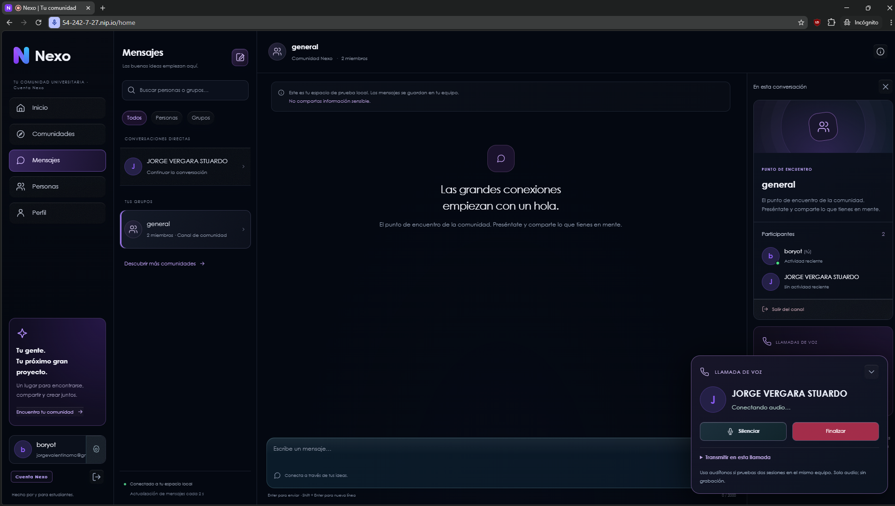

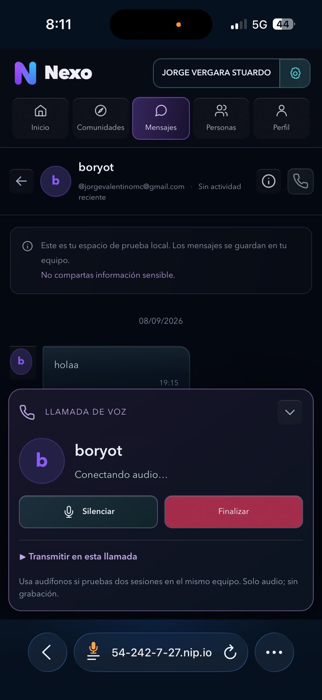

La señalización está aislada por identificador de conversación. Dos usuarios
solo pueden negociar audio cuando abren la misma conversación: uno inicia la
llamada y el otro acepta la llamada entrante. Iniciar dos llamadas independientes
—o hacerlo desde un grupo en un equipo y desde un chat directo en el otro— crea
sesiones distintas que no intercambian oferta y respuesta WebRTC.

Para repetir correctamente la prueba PC–5G, ambos usuarios deben abrir el chat
directo entre **boryot** y **JORGE VERGARA STUARDO**. Solo uno pulsa el teléfono;
el segundo espera el aviso entrante y lo acepta. Si vuelve a quedar pendiente
bajo esas condiciones, se deben correlacionar la señalización y las asignaciones
de Coturn antes de declarar una falla de red.

La repetición posterior sí utilizó el chat directo correcto, pero ICE continuó
pendiente. Coturn registró una asignación que se cerró sin transportar audio y
mostró que el relay estaba enlazado a la dirección privada de la VPS. La captura
siguiente conserva el estado observado antes de aplicar la corrección:

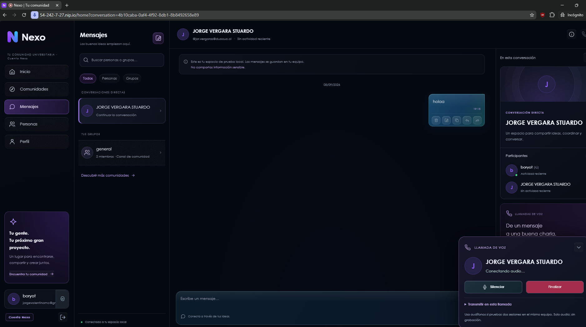

La EC2 está detrás de NAT: su interfaz utiliza `172.31.31.127` y la dirección
pública visible es `54.242.7.27`. Se reinició Coturn conservando credenciales,
puertos y política de reinicio, pero declarando el mapeo explícito
`54.242.7.27/172.31.31.127`. Este ajuste evita entregar a clientes externos una
dirección relay privada no enrutable. La validación PC–5G debe repetirse después
del reinicio antes de marcar el caso como aprobado.

#### IP elástica y dominio estable (8 de septiembre de 2026)

Para impedir que la URL pública cambie en cada reinicio del laboratorio, se
reservó la IP elástica `34.196.97.226`, con nombre
`nexo-academico-eip`, y se asoció a la instancia EC2 de Nexo. AWS confirmó la
asociación con la interfaz privada `172.31.31.127`. La dirección se debe mantener
asociada a la instancia mientras el proyecto esté activo; una IP pública sin
asociar puede generar costo innecesario.

El acceso estable quedó definido como:

- Aplicación: `https://34.196.97.226.nip.io`
- LiveKit: `wss://livekit.34.196.97.226.nip.io`
- TURN: `34.196.97.226:3479`, por UDP y TCP
- Relay TURN: UDP `49160-49200`

Se actualizaron `Caddyfile`, la configuración productiva del frontend, CORS y
la URL pública de LiveKit del backend. Coturn se recreó conservando sus
credenciales y política `restart always`, con el mapeo NAT
`34.196.97.226/172.31.31.127`. El frontend se recompiló correctamente y los
cuatro contenedores (`nexo-web`, `nexo-backend`, `nexo-livekit` y `nexo-turn`)
quedaron activos.

La primera prueba utilizó por error `34-196-97-226.nip.io`. Aunque ese nombre
también resuelve la IP, no coincide con el certificado emitido para
`34.196.97.226.nip.io` y produjo `ERR_SSL_PROTOCOL_ERROR`. Después de unificar
el nombre exacto, se verificó TLS 1.3 y respuesta HTTP `200` en `/login`. El
certificado de Let's Encrypt es válido para `34.196.97.226.nip.io` y su vigencia
observada termina el 7 de diciembre de 2026; Caddy se ocupa de su renovación
automática mientras el laboratorio, los puertos 80/443 y el DNS estén
disponibles.

La revisión completa del código desplegado encontró además que la versión
anterior construía `RTCPeerConnection` con `iceServers: []`. Por tanto, aunque
Coturn estaba activo, el navegador nunca recibía ni utilizaba el servidor TURN.
La versión actual pasa los servidores ICE del entorno y fuerza relay en
producción. La prueba funcional definitiva sigue siendo una llamada entre PC y
5G, dentro de la misma conversación, verificando audio bidireccional y luego
pantalla con audio compartido.

Cada paso completado debe añadir fecha, resultado observado, evidencia
redactada y configuración reversible. No incluir contraseñas, JWT, claves
privadas, secretos ni identificadores de cuenta AWS en las capturas publicadas.

Referencias del proyecto: [fase 5](phase-5-readiness.md),
[flujo Git](git-workflow.md), [servicios y transmisiones](transmisiones-y-servicios.md)
y [autenticación MSAL/JWT](autenticacion-msal-jwt.md).

#### Corrección de llamadas detenidas con micrófono permitido (9 de septiembre de 2026)

La reproducción con cuentas y redes diferentes mostró el estado **Preparando
micrófono y conexión** aunque el permiso del navegador estaba concedido. La
causa no era el dispositivo: producción forzaba tráfico WebRTC mediante relay,
pero la imagen `nexo-backend:cloud` desplegada era anterior y no incluía el
endpoint autenticado `GET /api/calls/ice-config`. Además, Coturn continuaba en
modo de usuario fijo mientras el código actual genera credenciales TURN
efímeras firmadas con HMAC-SHA1.

Se aplicaron estos cambios en la EC2:

- Coturn quedó en modo `use-auth-secret`, con secreto de 64 caracteres guardado
  únicamente en `/opt/nexo/backend.env` y permisos `600`.
- El servidor anuncia el mapeo NAT
  `34.196.97.226/172.31.31.127`, escucha en UDP/TCP `3479` y conserva el rango
  relay UDP `49160-49200`.
- El backend fue reconstruido desde el código que incluye
  `TurnCredentialService` y recreado con política `restart always`.
- La comprobación posterior devolvió HTTP `200` en el health check y el JAR
  desplegado contiene la clase del servicio TURN.
- El frontend ahora distingue un timeout ICE de un rechazo del micrófono. Si
  TURN no es alcanzable, informa que el micrófono funciona y que falló el
  servidor de audio, evitando pedir al usuario permisos que ya concedió.

Una prueba posterior confirmó que Coturn recibía solicitudes con el usuario
estático antiguo `nexo`. El frontend estaba combinando el fallback TURN antes
de la credencial efímera y Chromium reutilizaba esa primera entrada porque las
dos tenían la misma URL. Se ajustó la composición ICE: cuando el endpoint
autenticado entrega TURN dinámico, se descarta cualquier TURN de fallback, se
conserva STUN y se añade únicamente el relay firmado. Así no se envían dos
credenciales diferentes para el mismo servidor.

La credencial entregada a cada usuario expira en una hora y no se documenta ni
se expone en capturas. Para aprobar la prueba funcional aún se debe realizar una
llamada directa: una persona inicia, la segunda acepta, ambas confirman audio
bidireccional y luego repiten entre Wi-Fi y datos móviles. No deben iniciar dos
llamadas independientes.

#### Cuentas institucionales y audio de pantalla (9 de septiembre de 2026)

Se enviaron invitaciones B2B desde Microsoft Entra ID a dos cuentas
institucionales adicionales. En ambos casos se configuró como redirección la URL
estable `https://34.196.97.226.nip.io` y Azure mostró la confirmación **User
invitation in progress**. Los correos completos no se publican en esta bitácora
para no exponer datos personales. Cada estudiante debe aceptar su invitación
antes de iniciar sesión; luego MSAL obtiene el token de Microsoft y el backend
valida el JWT en cada petición protegida.

La transmisión utiliza resolución de origen —no fuerza una reducción de ancho o
alto— y selecciona **30 FPS** de forma predeterminada. El usuario aún puede elegir
15 o 60 FPS, sujeto a la fuente, navegador, red y capacidad del equipo.

Se corrigió el audio compartido en dos puntos:

- La pista de audio del sistema y la pista del micrófono se publican por separado
  como `ScreenShareAudio` y `Microphone`.
- El reproductor remoto conserva y reproduce todas las pistas de audio. Antes
  almacenaba una sola y la segunda podía reemplazar la primera, dejando inaudible
  el sonido de la pantalla.
- Desactivar **Micrófono** ya no elimina el audio de pantalla seleccionado.

Para compartir sonido en Chrome o Edge, el emisor debe marcar **Compartir audio**
en el selector nativo. Compartir una pestaña ofrece la compatibilidad más
predecible. La captura de audio del sistema no está disponible en todos los
navegadores ni en todos los móviles; es una limitación de `getDisplayMedia`, no
del servidor LiveKit.

La llamada de voz actual sigue siendo directa entre dos usuarios y usa WebRTC
P2P con TURN. Una llamada grupal real no se obtiene habilitando el canal actual:
requiere migrar ese flujo a una sala SFU de LiveKit, emitir tokens publicador/
suscriptor para cada miembro, administrar entrada y salida de participantes y
crear una interfaz de sala. Se mantiene como siguiente incremento para evitar
presentar como terminada una función que aún no tiene señalización ni controles
de participantes.

Validación automatizada de esta corrección: **22 archivos de pruebas, 77 pruebas
aprobadas**, además de compilación productiva correcta. La aceptación manual debe
usar dos cuentas: una comparte una pestaña con **Compartir audio** activado y la
otra confirma simultáneamente imagen, sonido del contenido y micrófono.
