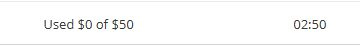

# EP1: despliegue académico de Nexo

Fecha: 8 de septiembre de 2026. Estado: diseño ajustado a la pauta; despliegue pendiente.

## Fechas y disponibilidad del laboratorio

- Presentación: viernes **11 de septiembre de 2026**.
- Conservar el entorno para pruebas hasta el domingo **13 de septiembre de 2026**.
- El usuario informa un saldo de **USD 50**. La interfaz consultada muestra
  `Used $0 of $50`; AWS Academy advierte que el gasto mostrado puede demorarse
  entre 8 y 12 horas en actualizarse. El saldo no es una estimación del despliegue.
- El README del laboratorio indica que EC2 se detiene al finalizar la sesión y
  se vuelve a iniciar al comenzar otra. Por ello se prepara disponibilidad durante
  sesiones del laboratorio; no se promete servicio 24/7 hasta el domingo.
- Después de un arranque puede cambiar la IPv4 pública. Preferir una integración
  privada que no dependa de esa IP o documentar y probar su actualización.



### Comprobación antes de presentar

1. Abrir AWS Academy y comenzar la sesión con antelación.
2. Esperar las comprobaciones de EC2 y el estado disponible de RDS.
3. Verificar Docker y los contenedores, luego readiness y acceso a la base.
4. Verificar la integración de API Gateway y el frontend configurado.
5. Repetir login Microsoft, perfil 200, petición anónima 401 y autorización 403.
6. Cerrar sesión y comprobar que no se permite volver a una ruta protegida.
7. Conservar las capturas y resultados con fecha; mantener una demostración
   documentada disponible si el laboratorio tarda en reactivarse.

La ampliación posterior al domingo dependerá del saldo real y la vigencia del
laboratorio. No se ha programado una eliminación ni una detención automática.

## Alcance de la evaluación

Fuente: `EP1_DSY1107_Estudiante_encargo.pdf`, páginas impresas 1 a 4.
La pauta asigna 60% a Angular/MSAL (login, logout, guards, interceptor,
tokens, roles y scopes) y 40% a la validación JWT del BFF y API Manager
(firma, issuer, audience, vigencia, autorización y errores adecuados).
Las instrucciones también exigen varios microservicios Java/Spring Boot,
base cloud, componentes compilables, pruebas básicas y entrega GitHub.

La pauta llama al sistema Pedidos360. Esta entrega adapta el caso a Nexo;
confirmar con el docente que el cambio de dominio de negocio es aceptado.
No afirmar conformidad total por pasar solo las pruebas de autenticación.

## Arquitectura mínima propuesta

| Componente | Ubicación | Responsabilidad |
| --- | --- | --- |
| Angular/MSAL | PC, `http://localhost:4200`, primera demostración | Login/logout y consumo de la API cloud |
| HTTP API Gateway | AWS, endpoint HTTPS administrado | Validación JWT y scopes de las rutas |
| BFF Spring Boot | Contenedor en una EC2 compartida | Validar JWT y delegar llamadas autorizadas |
| Servicio de usuarios Spring Boot | Otro contenedor en la misma EC2 | Perfil e identidad Microsoft persistidos |
| Servicio de comunidad Spring Boot | Otro contenedor en la misma EC2 | Conversaciones y mensajes de Nexo |
| PostgreSQL | RDS Single-AZ, privado | Persistencia con usuarios/esquemas separados por servicio |

Esta separación es un objetivo pendiente: el backend actual es un monolito
modular. No contar Docker, PostgreSQL o LiveKit como microservicios Spring Boot.
La extracción debe conservar contratos y verificar autorización en cada servicio;
no basta ejecutar varias copias del backend ni dividir solamente carpetas.

Se comparte una EC2 para reducir costo de cómputo. Se comparte una instancia RDS
como concesión académica, con propiedad de datos explícita por servicio. El BFF
no accede directamente a tablas de otros servicios. No añadir Kubernetes,
réplicas, NAT Gateway, RDS Proxy o balanceadores sin una necesidad comprobada.

## HTTP y ausencia de dominio

No hace falta comprar un dominio para usar el endpoint HTTPS que proporciona
API Gateway. Microsoft permite HTTP para redirects locales; una IP pública
con HTTP no sustituye un redirect SPA HTTPS. Para la primera prueba se conserva
Angular en localhost y se conectan los servicios cloud.

Si se requiere frontend público, preparar después un alojamiento con nombre y
certificado administrados. La conexión interna entre contenedores puede usar
HTTP. La integración Gateway-EC2 debe resolverse con una ruta protegida; no
exponer JWT por una integración HTTP pública sin revisar el transporte y acceso.
RDS debe usar TLS y permitir 5432 únicamente desde el grupo de seguridad EC2.

Referencias: [redirects Entra](https://learn.microsoft.com/en-us/entra/identity-platform/reply-url)
y [referencia API Gateway v2](https://docs.aws.amazon.com/apigatewayv2/latest/api-reference/api-reference.html).

## Docker y arranque

Después de instalar Docker desde una fuente oficial, el servicio del sistema
se habilita con:

```bash
sudo systemctl enable --now docker
sudo systemctl status docker --no-pager
```

Cada servicio de Compose debe declarar `restart: unless-stopped` para reiniciar
tras fallos o reinicios del host, respetando una detención manual. La alternativa
`restart: always` también existe, pero vuelve a iniciar contenedores detenidos
cuando reinicia Docker. `sudo systemctl restart docker` reinicia el motor; no
configura una política de reinicio de los contenedores.

Operación prevista, una vez exista y esté validado el archivo de despliegue:

```bash
docker compose up -d
docker compose ps
docker compose logs --tail=100
docker compose stop
```

Construir imágenes antes de enviarlas a la EC2 pequeña; no compilar varios
proyectos Java simultáneamente en el servidor de demostración. Fijar versiones,
limitar memoria y rotar logs. Mantener secretos fuera de Git y de capturas.

## Recursos y control de créditos

- Una EC2 pequeña, con memoria suficiente para tres procesos JVM. Evaluar
  2 GiB con límites y pruebas; aumentar solo si la evidencia de memoria lo exige.
- Una RDS PostgreSQL de clase micro admitida por el laboratorio, Single-AZ,
  almacenamiento mínimo admitido, sin acceso público ni réplicas.
- Elegir versión PostgreSQL con soporte estándar para evitar cargos de soporte
  extendido. Confirmar opciones y estimación en la consola antes de crear.
- No asumir capa gratuita. Registrar cómputo, discos, IPv4 pública, solicitudes,
  backups y tráfico. El menor costo depende también de las horas encendidas.
- Detener EC2 y RDS fuera de las pruebas no elimina costos de almacenamiento.
  RDS vuelve a arrancar tras siete días detenido; planificar cierre del laboratorio.
- Presupuesto disponible comunicado: USD 50; objetivo de ahorro: consumir solo
  lo necesario para las sesiones hasta el domingo y conservar una reserva.
  La estimación concreta sigue pendiente y no se ha creado infraestructura.

Referencia: [detención temporal de RDS](https://docs.aws.amazon.com/AmazonRDS/latest/UserGuide/USER_StopInstance.html).

## Evidencias por paso

| Paso | Captura / evidencia requerida | Estado |
| --- | --- | --- |
| Inventario | EC2 y RDS de la región, sin datos privados | Inventario leído: ambos vacíos |
| Azure | SPA, redirect, API scope, sin secretos | Pendiente de sesión en el tenant |
| EC2 | Tipo, estado saludable y contenedores activos | Pendiente |
| RDS | PostgreSQL disponible, privado, conexión desde servicio | Pendiente |
| Gateway | Integración, issuer, audience, scope, CORS | Pendiente |
| Login | Entrada en Brave, regreso a Nexo y perfil persistido | Pendiente |
| Autorización | 200/401/403 observados, sin JWT completo | Pendiente |
| Logout | Regreso al login y rutas protegidas bloqueadas | Pendiente |
| Reinicio | Recuperación de contenedores y datos conservados | Pendiente |

Guardar imágenes solo después de revisar datos visibles. Las capturas de un
formulario no acreditan un recurso creado ni una conexión funcional.

## Funcionalidad posterior a EP1

STUN/TURN, transmisiones entre redes, WebSocket/presencia persistente, adjuntos,
grupos privados y webhooks firmados siguen en el backlog de Nexo. No son indicadores
explícitos de esta pauta y no deben consumir el presupuesto antes de cerrar el
flujo MSAL, BFF, API Gateway, microservicios y RDS. Conservar la funcionalidad local
existente sin presentarla como probada en la nube.
