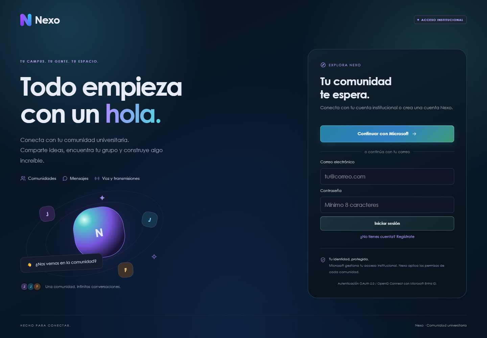
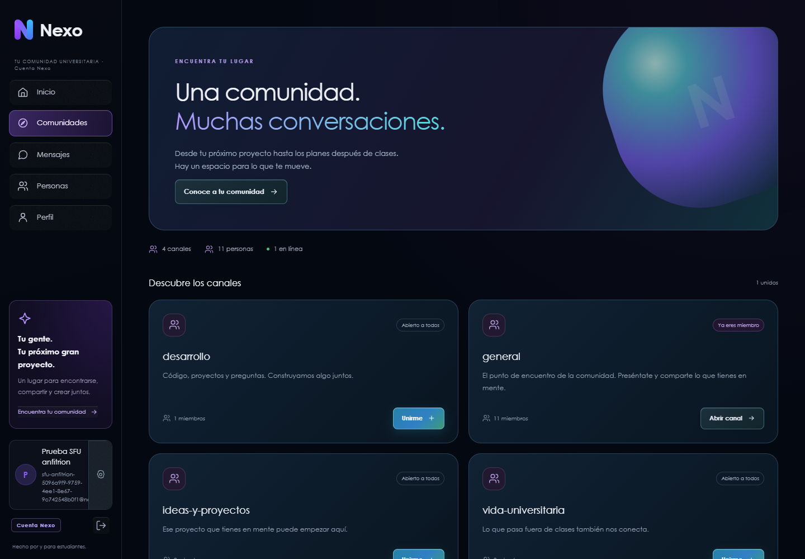
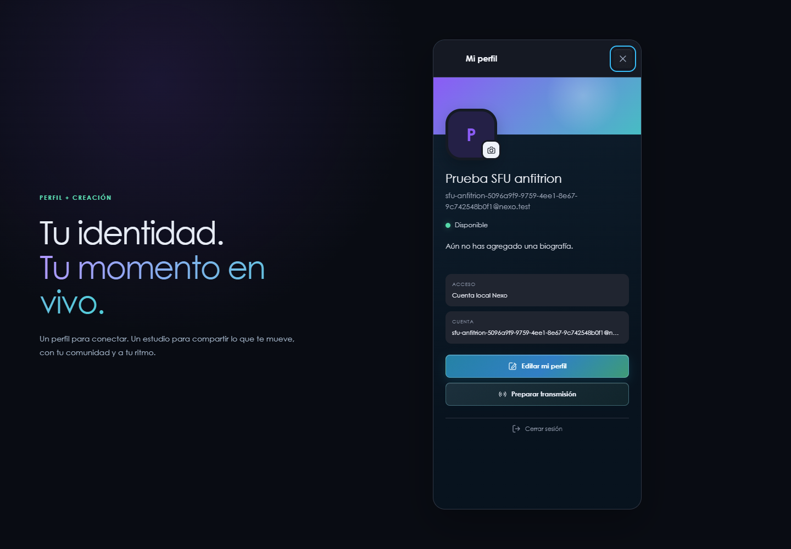
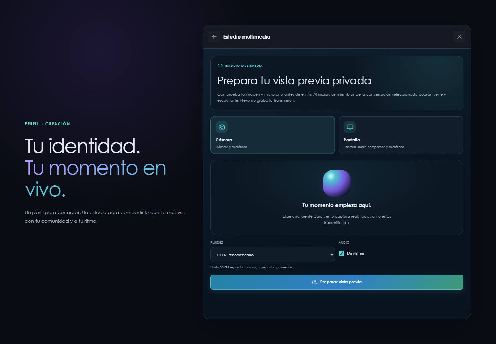
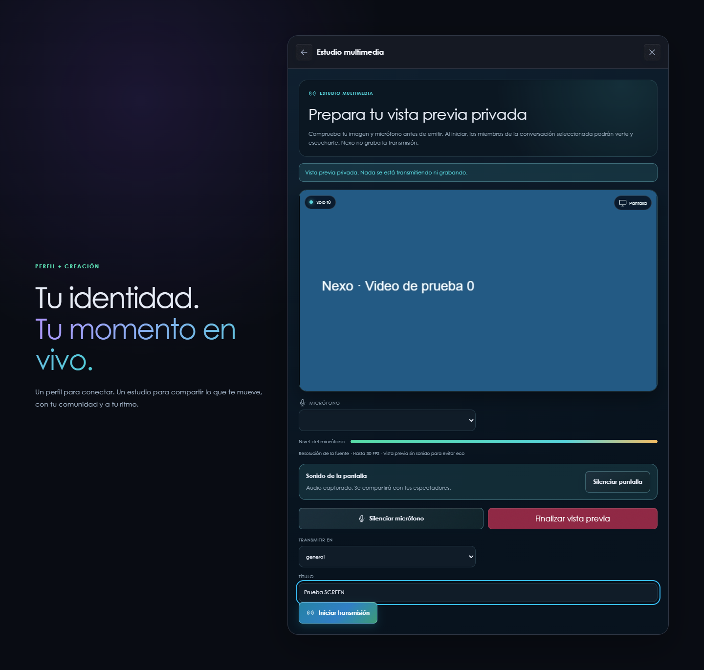
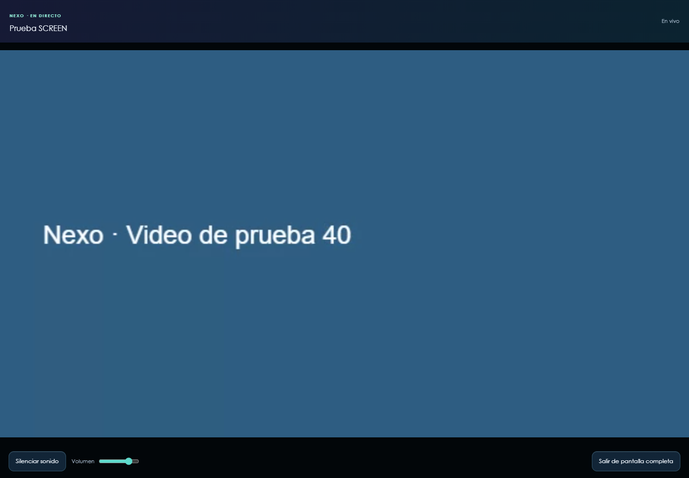

# Experiencia visual y multimedia de Nexo

Fecha: 9 de septiembre de 2026. Rama: `feat/experiencia-multimedia`.
Base: `feat/despliegue-cloud`. Este incremento modifica el frontend; no cambia
credenciales, esquema de base de datos, membresías, puertos ni recursos cloud.

## Tickets y alcance

| Ticket | Estado | Resultado |
| --- | --- | --- |
| NEXO-UX-01 | Implementado y probado localmente | Login, comunidades y perfil con identidad Nexo: azul nocturno, violeta/cian, formas orbitales y tarjetas adaptables. |
| NEXO-MEDIA-01 | Implementado y probado localmente | Micrófono y sonido de pantalla independientes; cambiar micrófono conserva la pista compartida. |
| NEXO-MEDIA-02 | Implementado y probado localmente | Reproductor con volumen, activación de audio y pantalla completa sin recrear video ni conexión. |
| NEXO-MEDIA-03 | Implementado y probado localmente | Vista previa privada real, estado explícito de audio capturado y controles adaptados al ancho del estudio. |
| NEXO-MEDIA-04 | Pendiente de aceptación manual | Audio físico de pestaña/PC, Safari/iPhone, Android y redes móviles reales. |
| NEXO-UX-DEPLOY | Implementado; aceptación manual pendiente | Rama `feat/experiencia-multimedia` publicada en EC2 con commit `dee4fb0`; se conservaron los valores cloud de MSAL del entorno anterior. |

Las referencias visuales se adaptaron a Nexo, conservando su logo, formularios,
acceso Microsoft, registro y datos reales. Las ilustraciones son CSS; no se
añadieron imágenes pesadas ni una dependencia gráfica. La esfera del estado
inicial es decorativa y está identificada como una vista **sin preparar**.

## Cómo transmitir pantalla con sonido

1. Abre **Perfil → Preparar transmisión** o el estudio de la llamada.
2. Elige **Pantalla** y la fluidez. El valor inicial es **30 FPS**; hay 15 y 60.
3. Pulsa **Preparar vista previa**. En el selector del navegador elige la fuente
   y activa **Compartir audio** si está disponible. Para la primera prueba,
   utiliza una pestaña que reproduzca sonido en Chrome/Edge de escritorio.
4. Revisa la captura real y el recuadro **Sonido de la pantalla**. Si dice
   **No se recibió audio**, finaliza la vista previa y vuelve a seleccionar
   una fuente con audio. Nexo no puede activar esa casilla por ti.
5. El micrófono se silencia con **Silenciar micrófono**. El audio compartido se
   controla con **Silenciar pantalla**. Ninguno desactiva el otro.
6. Elige conversación y título, y pulsa **Iniciar transmisión**. Preparar la
   vista previa por sí solo no publica nada. No se graba la transmisión.
7. El espectador pulsa **Ver transmisión**. Puede ajustar volumen o activar
   sonido si el navegador bloqueó la reproducción automática. El volumen del
   visor afecta a ambas pistas recibidas, no al volumen de otros espectadores.
8. **Pantalla completa** amplía el mismo reproductor. Escape o el botón de
   salida regresan a la vista normal. Sin Fullscreen API hay una vista ampliada
   dentro de la página, con aviso explícito.
9. **Finalizar transmisión** cierra la emisión y libera los dispositivos.

La vista previa propia está siempre silenciada para evitar eco. Es normal que
el emisor no escuche una segunda copia de su PC a través de Nexo. La casilla
Micrófono prepara esa pista silenciada si está desmarcada; el navegador todavía
solicita permiso del micrófono para poder activarlo durante la emisión.

## Qué se corrigió

- `MediaDeviceService` identifica las pistas de pantalla por ID: silenciar o
  reemplazar el micrófono ya no afecta al audio compartido. El medidor analiza
  solamente el micrófono. Las solicitudes canceladas no sobrescriben los IDs
  de una captura nueva.
- `BroadcastMediaService` publica `ScreenShareAudio` y `Microphone` por separado.
  El micrófono puede publicarse deshabilitado y activarse después. La recepción
  conserva todas las pistas de audio y descarta aperturas concurrentes obsoletas.
- `BroadcastViewerComponent` mantiene el nodo `<video>`, conecta ambas pistas
  a elementos de audio y amplía el contenedor completo. Cambiar título o tamaño
  no vuelve a pedir acceso a la sala. El control adaptativo usa densidad 1 para
  evitar demanda extra de decodificación por píxeles de pantallas Retina.
- Una respuesta temporal fallida del listado de emisiones ya no desmonta el
  visor que sigue conectado por LiveKit. Una lista válida sin la emisión sí
  lo cierra. Esto no sustituye la revocación inmediata de permisos pendiente.
- Login y comunidades se verifican a 1440, 768 y 390 px; estudio y visor también
  se prueban a 390 px. El estudio usa consultas de contenedor: se adapta tanto
  a un panel lateral como a una llamada pequeña, no solo al ancho del navegador.

## Calidad y compatibilidad: límites reales

No se impone un tamaño de captura reducido: se solicita la resolución que
entregue la fuente. Esto **no equivale a video sin compresión ni garantiza 4K**.
WebRTC/LiveKit adaptan la capa recibida a tamaño, capacidad y red. Se conserva
VP8 con simulcast y topes de 1,5/3/6 Mbps para 15/30/60 FPS; aumentar resolución
o fluidez puede reducir nitidez con ese presupuesto.

El sonido de pestaña, ventana o escritorio depende del navegador, sistema
operativo y selección del usuario. `systemAudio: include` es una solicitud,
no una garantía. No se promete captura de pantalla/audio de sistema en todos
los móviles. Ver [captura de pantalla en LiveKit](https://docs.livekit.io/transport/media/screenshare/)
y [getDisplayMedia en MDN](https://developer.mozilla.org/en-US/docs/Web/API/MediaDevices/getDisplayMedia).

El modo ampliado alternativo conserva los controles cuando no está disponible
la [Fullscreen API](https://developer.mozilla.org/en-US/docs/Web/API/Fullscreen_API/Guide).
Las limitaciones de red, TURN, carga de CPU o reproducción automática pueden
seguir afectando equipos concretos; tres ciclos locales no prueban todas las redes.

## Evidencia reproducible

Resultado de esta revisión: **86 pruebas unitarias aprobadas**, compilación de
producción sin advertencias de presupuesto y prueba E2E local aprobada en Chrome
152. Las métricas y el instante de la última ejecución quedan en
[verification.json](evidence/experiencia-multimedia/verification.json).

- `npm.cmd run test:ci --prefix frontend`: pruebas unitarias de dispositivos,
  publicación/recepción, ciclo de vida, fullscreen, controles y estados del estudio.
- `npm.cmd run build --prefix frontend`: compilación de producción.
- `scripts/verify-broadcast.cjs`: dos cuentas de prueba en contextos separados,
  backend Spring/PostgreSQL y servidor LiveKit locales. El espectador no solicita
  cámara/micrófono y no tiene permiso de publicar.
- La prueba genera video de **640×360 a 10 FPS** y tonos, en vez de grabar
  dispositivos o contenido privado. Valida llegada de bytes de ambas pistas
  de audio, mute independiente, tres ciclos de fullscreen con avance de frames
  dentro y después, identidad del nodo/conexión, HTTP 503 simulado, cierre remoto
  y limpieza de sala tras cerrar al anfitrión inesperadamente.
- Los 409 iniciales de `/start` pueden aparecer mientras LiveKit registra las
  pistas; se reintentan. El 503 es intencional. Se requiere cero excepciones
  JavaScript no controladas, no una consola completamente vacía durante fallos.

Ejemplo PowerShell, con los servicios locales previamente configurados:

```powershell
$env:NEXO_TEST_URL='http://127.0.0.1:4200'
$env:NEXO_BROWSER_EXECUTABLE='C:\Program Files\Google\Chrome\Application\chrome.exe'
$env:NEXO_CAPTURE_DIR='docs/evidence/experiencia-multimedia'
node scripts/verify-broadcast.cjs
```

Playwright debe estar disponible para Node (instalación de herramientas o
`NODE_PATH`). Las cuentas de prueba se guardan en `.tmp`, excluida de Git. No
ejecutar ese script sobre producción: registra cuentas y crea transmisiones.
En esta sesión el backend local usó **8081** porque 8080 estaba ocupado por
otra aplicación; Angular usa un proxy temporal en `.tmp/multimedia-proxy.json`.
No se detuvo ni modificó esa otra aplicación.

### Capturas nuevas

Capturas auténticas del navegador local, con cuentas y medios de prueba.
Los visores se recortan al componente para no publicar conversaciones ajenas.



[Login móvil](evidence/experiencia-multimedia/login-390.png) ·
[Login tablet](evidence/experiencia-multimedia/login-768.png).



[Comunidades móvil](evidence/experiencia-multimedia/communities-390.png) ·
[Comunidades tablet](evidence/experiencia-multimedia/communities-768.png).







[Estudio móvil](evidence/experiencia-multimedia/broadcast-studio-mobile.png) ·
[Visor móvil](evidence/experiencia-multimedia/viewer-mobile.png).



### Estado cloud y aceptación pendiente

El incremento quedó publicado en la EC2 académica `nexo-backend-academico`
(us-east-1), con la rama `feat/experiencia-multimedia` y el commit `dee4fb0`.
La URL pública responde mediante Caddy en
<https://34.196.97.226.nip.io/>. Se verificaron `200 OK` en `/` y `/login`, y
el backend interno respondió `{"status":"UP"}` en el readiness de Actuator.
El frontend se reconstruyó y el contenedor se dejó con `restart: always`.
La configuración cloud de Microsoft se recuperó desde el checkout anterior,
que quedó preservado en `/opt/nexo/app-predeploy-20260909` para rollback.

- [x] Desplegar el frontend de esta rama conservando la configuración cloud.
- [ ] Probar una pestaña con audio real y confirmar escucha desde otra cuenta.
- [ ] Silenciar solo micrófono, luego solo pantalla, y comprobar ambos extremos.
- [ ] Probar fullscreen con contenido en movimiento y volver al chat.
- [ ] Completar matriz Safari/iPhone, Chrome/Android y PC en Wi-Fi/datos.

Los servicios vigentes y pendientes de infraestructura siguen en
[transmisiones y servicios](transmisiones-y-servicios.md) y los tickets cloud del
[README](../README.md#roadmap). Esta mejora no marca esos pendientes como terminados.
