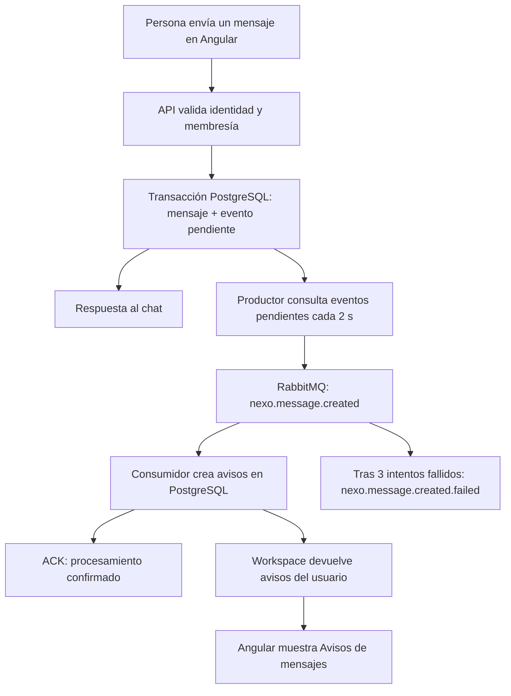
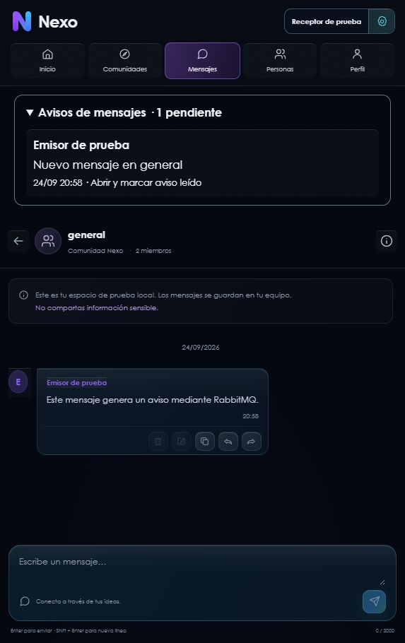

# RabbitMQ aplicado a Nexo

Implementación iniciada localmente el 24 de septiembre de 2026 y desplegada en
AWS el 25 de septiembre de 2026, tomando como referencia
`Guia_EA2_Clase1_Pedidos360_RabbitMQ.pdf` y `powershell.txt`.

## Qué se incorporó

La guía enseña un productor, una cola durable y un consumidor que imprime un pedido.
En Nexo se aplica a una tarea concreta: **crear avisos de mensajes para otros miembros
de una conversación**, en segundo plano. Se conserva el monolito modular existente.

| Referencia Pedidos360 | Adaptación en Nexo |
| --- | --- |
| Crear Angular y Spring desde cero | Reutilizar el frontend y backend actuales |
| Spring AMQP | `spring-boot-starter-amqp`, versión gestionada por Spring Boot |
| `GET /pedido?mensaje=...` | El `POST` autenticado de mensajes ya existente |
| `PedidoProducer` | `MessageEventPublisher`, que publica los eventos pendientes |
| `pedidos.queue` | `nexo.message.created`, durable |
| `PedidoConsumer` imprime en consola | `MessageEventConsumer` persiste avisos |
| Panel de RabbitMQ | Disponible localmente en el puerto 15672 |
| Script que instala herramientas y crea proyectos | `scripts/start-rabbitmq.ps1` configura el broker del proyecto actual |

El script adjunto se trató como referencia: no se ejecutó su instalación global ni
se creó otro proyecto Pedidos360. Tampoco se añadió un endpoint público que produzca
eventos mediante GET.

## Flujo completo



1. Se guarda el mensaje y su evento pendiente en **la misma transacción**. Si falla
   el guardado, no queda un evento huérfano. Si RabbitMQ está caído, la API no espera
   su conexión para aceptar el mensaje.
2. Un proceso programado publica lotes de hasta 20 identificadores de mensajes.
   El evento contiene el UUID, tipo `message.created.v1` y entrega persistente;
   no copia el texto privado del chat al broker.
3. El productor elimina el pendiente solo al recibir confirmación positiva y
   comprobar que el broker no devolvió el evento por falta de ruta.
4. El consumidor consulta el mensaje y crea avisos para miembros activos que
   pertenecían al canal antes de enviarse y siguen perteneciendo al procesarse.
   El autor no recibe su propio aviso. La transacción se confirma antes del ACK.
5. La clave `(message_id, user_id)` evita duplicados incluso si un evento se entrega
   otra vez después de un reinicio. Un aviso leído no vuelve a aparecer al reprocesarlo.
6. El workspace devuelve hasta 50 avisos pendientes, del más reciente al más antiguo.
   Angular usa su consulta existente cada 5 segundos. Abrir el aviso selecciona
   la conversación y marca **ese aviso** como leído; no implica que el mensaje
   tenga confirmación de lectura para el emisor.

## Cómo se ve



Captura de la aplicación real, con dos cuentas de prueba y PostgreSQL temporal.
Se comprobó el inicio de sesión local, la generación del aviso mediante el broker
y su desaparición al abrirlo. No se añadieron mensajes a la base habitual del proyecto.

Encima de la conversación aparece **“Avisos de mensajes · N pendientes”** cuando hay
avisos. Al desplegarlo se ve quién escribió, la conversación, la fecha y la acción
para abrirla y marcar el aviso leído. No hace falta tener abierta esa conversación
cuando se envía el mensaje. Los avisos permanecen en la base de datos entre sesiones.

Se comprueba la membresía al consultar y al marcar el aviso: abandonar un canal
oculta sus avisos. Volver a entrar no recupera los anteriores a la nueva membresía.
Borrar un mensaje elimina también su evento pendiente y sus avisos por claves foráneas.
Editar el texto no genera otro aviso. Los mensajes históricos no se reprocesan.

## Qué mejora y qué sigue igual

| Aspecto | Resultado |
| --- | --- |
| Trabajo adicional al enviar | La creación de avisos se procesa fuera de la petición HTTP |
| Interrupción temporal del broker | Los eventos esperan en PostgreSQL y se reintentan |
| Consumidor detenido | Los eventos publicados esperan en RabbitMQ |
| Reintento del mismo envío o entrega duplicada | No duplica el mensaje ni los avisos |
| Diagnóstico | Colas pendientes, consumidores y eventos fallidos visibles en RabbitMQ |
| Experiencia | Bandeja persistente de avisos de conversaciones |

Esto no demuestra menor latencia del chat ni mayor capacidad: no se hizo una prueba
de carga. Añade un proceso y consumo de memoria. El beneficio comprobado es separar
la creación de avisos y recuperarse de interrupciones temporales. El chat mantiene
su polling HTTP de 2 segundos; el workspace, 5 segundos. RabbitMQ no añade WebSocket,
notificaciones push del sistema, correo, ni sustituye LiveKit/WebRTC.

## Activación local

Requisitos: la configuración local habitual de Nexo, Docker Desktop y Java 21.
Desde la raíz del repositorio:

```powershell
.\scripts\start-rabbitmq.ps1
cd backend
.\mvnw.cmd spring-boot:run
```

El script conserva las claves existentes de `.env`, añade una contraseña aleatoria
para RabbitMQ si falta, activa `NEXO_EVENTS_ENABLED=true` y levanta únicamente el
servicio `rabbitmq`. Nunca muestra la contraseña. Reinicia el backend que ya estuviera
ejecutándose para que tome los cambios. La migración V11 se aplica al iniciar.

Para ejecutar también el backend en Compose:

```powershell
docker compose --profile events --profile app up -d --build
```

El broker usa volumen persistente `rabbitmq_data`, hostname estable y puertos
publicados solo en `127.0.0.1`. El backend en Docker conecta a `rabbitmq:5672`;
el backend ejecutado con Maven usa `localhost:5672`. Las credenciales se consultan
en `.env` (`RABBITMQ_USER` y `RABBITMQ_PASSWORD`).

Panel: <http://localhost:15672>. Si el puerto ya está ocupado, cambia
`RABBITMQ_MANAGEMENT_PORT`. El cambio de credenciales en `.env` no modifica usuarios
de un volumen RabbitMQ ya inicializado: conserva las originales o administra el
usuario existente; no borres el volumen para resolver un error de contraseña.

En esta máquina el puerto 8080 estaba ocupado por otro proyecto al verificar.
La revisión visual usó backend 8081 y Angular 4201 con una base temporal. Para usar
otros puertos en tu sesión, ajusta `SERVER_PORT`, el proxy de Angular y CORS juntos.

## Despliegue comprobado en AWS

La integración está activa en la instancia EC2 `nexo-backend-academico`, dentro de
la red Docker privada `nexo-cloud`. Se reutilizó la dirección pública estable de
Nexo: <https://34.196.97.226.nip.io>.

- `nexo-rabbitmq` ejecuta RabbitMQ 4.2 con imagen Alpine, reinicio automático,
  límite de memoria de 384 MiB y volumen persistente `nexo_rabbitmq_data`.
- RabbitMQ no publica `5672` ni `15672` en el host. El backend se conecta mediante
  el alias interno `nexo-rabbitmq:5672`; no fue necesario ampliar el Security Group.
- La contraseña del broker se generó en la instancia, no se imprimió ni se añadió
  al repositorio. Los archivos `/opt/nexo/rabbitmq.env` y `/opt/nexo/backend.env`
  quedan con permisos `0600`.
- El backend se reconstruyó desde el commit `d3324e2` de la rama
  `feature/rabbitmq-responsive-aws`. El despliegue conservó una imagen de reversión
  hasta que la nueva instancia superó readiness.
- Flyway aplicó V11 en RDS. Después, Spring AMQP abrió la conexión y dejó un
  consumidor activo en `nexo.message.created`.

Validación observada después del despliegue:

| Comprobación | Resultado |
| --- | --- |
| Readiness interno | `UP` |
| Sitio HTTPS público | HTTP 200 |
| `nexo.message.created` | durable, 1 consumidor |
| `nexo.message.created.failed` | durable, 0 mensajes |
| Puertos publicados por RabbitMQ | ninguno |
| Migración | V11 aplicada correctamente en RDS |

El frontend productivo se recompiló conservando la configuración real de Microsoft
Entra, LiveKit y TURN. Se verificó el sitio desplegado en 320×568, 844×390 y
768×1024 sin desbordamiento horizontal. Los paneles de llamada individual y grupal
ahora limitan su altura, permiten desplazamiento interno, respetan áreas seguras y
mantienen controles táctiles de 44 px. El estudio y el visor de pantalla compartida
adaptan sus columnas y controles a contenedores estrechos y al modo horizontal.

En Microsoft Entra se comprobó que `Nexo Frontend` sigue activo como SPA y mantiene
la URI productiva `https://34.196.97.226.nip.io`. RabbitMQ no requiere otro registro,
scope ni secreto en Azure; la autenticación continúa usando `Nexo Frontend` para la
SPA y `Nexo Web` para el scope `access_as_user`.

## Demostración equivalente a la guía

1. Ejecuta `.\scripts\start-rabbitmq.ps1 -PauseConsumer` y reinicia el backend.
2. Inicia sesión con dos cuentas Nexo que pertenezcan al mismo canal. Envía desde
   una cuenta un mensaje con texto nuevo.
3. Abre **Queues and Streams → nexo.message.created** en el panel. Tras el ciclo
   del productor debe aparecer `Ready > 0`, `Consumers = 0`; el texto del chat
   ya existe aunque el aviso todavía no esté creado. Con el consumidor desactivado,
   las colas se declaran cuando se publica el primer pendiente.
4. Ejecuta `.\scripts\start-rabbitmq.ps1` sin el parámetro y reinicia el backend.
5. El consumidor procesa la cola: `Consumers = 1` y `Ready` vuelve a cero si no
   siguen entrando eventos. En la segunda cuenta aparece el aviso, normalmente
   tras el próximo refresco del workspace. `Ready = 0` solo no prueba éxito:
   revisa también `Unacked`, la cola `.failed` y el aviso persistido.
6. Abre el aviso. La conversación se selecciona y el aviso desaparece.

Para reproducir una caída, detén solo RabbitMQ con
`docker compose stop rabbitmq`, envía un mensaje y vuelve a ejecutar
`docker compose --profile events up -d rabbitmq`. El pendiente se recupera cuando
el broker vuelve. No uses `docker compose down -v`: borraría datos de los volúmenes.

Consultas opcionales para diagnóstico (con acceso administrativo a PostgreSQL):

```sql
SELECT count(*) AS pendientes_de_publicar FROM nexo.message_outbox;
SELECT count(*) AS avisos_sin_leer FROM nexo.message_notifications WHERE read_at IS NULL;
```

## Validación y límites

- 46 pruebas backend aprobadas, incluidas 4 nuevas con PostgreSQL y RabbitMQ reales
  en Testcontainers. Se probaron persistencia tras reinicio del broker, duplicados,
  conservación de estado leído, autorización, rollback, recuperación de caída y
  envío de eventos inválidos a la cola de fallos.
- 89 pruebas frontend aprobadas, incluidas ruta por tipo de sesión y conservación
  del aviso cuando falla la confirmación del servidor. Tras separar el componente
  visual se repitieron sus 5 pruebas de Home y la compilación, sin advertencias.
- El health de RabbitMQ se activa cuando los eventos están habilitados. Readiness
  sigue comprobando la base de datos y la aplicación, permitiendo servir el chat
  mientras el broker se recupera.
- Compose validado y broker local saludable con `rabbitmq-diagnostics ping`.
  El script se ejecutó en esta máquina: eventos habilitados en `.env`, credenciales
  generadas localmente y servicio `nexo-rabbitmq-1` activo. El backend habitual
  necesita reiniciarse para cargar esa configuración y aplicar V11.

Los eventos agotados en `.failed` necesitan revisión y reenvío controlado; no existe
un botón de recuperación automática. Esta instalación tiene un broker y un volumen
locales, sin alta disponibilidad ni respaldo contra pérdida del disco. El relay
usa lotes pequeños, confirmaciones secuenciales y locks de PostgreSQL; para alto
volumen habría que medirlo y separar el proceso. Se conservan los avisos leídos
para deduplicar; falta una política de retención para operación prolongada.

Desactivar `NEXO_EVENTS_ENABLED` deja de producir y consumir nuevos eventos; los
pendientes existentes quedan guardados para reactivar. En AWS esta variable está
activa tanto para el productor como para el consumidor.

Fundamento técnico: [fiabilidad de RabbitMQ](https://www.rabbitmq.com/docs/reliability)
y [confirmaciones y retornos de Spring AMQP](https://docs.spring.io/spring-amqp/reference/amqp/template.html).
Cola durable, mensajes persistentes y confirmaciones cumplen funciones distintas;
la deduplicación permite tolerar entregas repetidas, no prometer entrega exactamente una vez.
