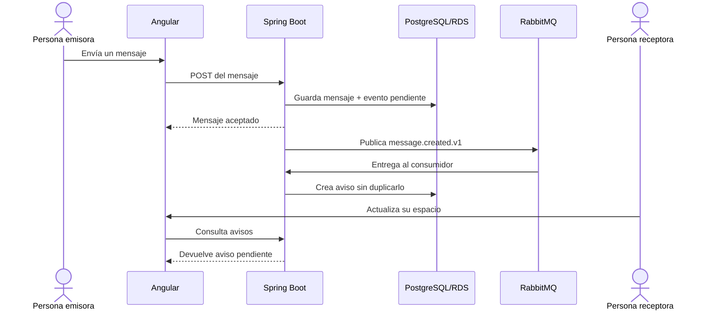

# RabbitMQ en Nexo: explicación y evidencia visual

## ¿Qué es RabbitMQ?

RabbitMQ es un **intermediario de mensajes**. Recibe trabajos desde una parte de la
aplicación, los conserva en una cola y los entrega a otra parte cuando está lista
para procesarlos.

En este modelo intervienen tres elementos:

| Elemento | Función | En Nexo |
| --- | --- | --- |
| Productor | Publica un trabajo | El backend publica que se creó un mensaje |
| Cola | Conserva el trabajo hasta su procesamiento | `nexo.message.created` |
| Consumidor | Recibe y ejecuta el trabajo | Crea los avisos para los miembros de la conversación |

Esto permite que el envío del chat y la creación de avisos no dependan del mismo
instante. Si RabbitMQ se detiene temporalmente, el mensaje sigue guardado en
PostgreSQL y el evento pendiente se publica cuando el broker vuelve.

RabbitMQ no reemplaza PostgreSQL, el chat HTTP ni LiveKit. PostgreSQL conserva los
mensajes y avisos; LiveKit continúa atendiendo llamadas y pantalla compartida;
RabbitMQ coordina el trabajo asíncrono de notificación.

## ¿Cómo se refleja en Nexo?

**Captura 1.** Evidencia funcional de Nexo. El mensaje “Este mensaje genera un
aviso mediante RabbitMQ” fue enviado en `general`. La cuenta receptora muestra
arriba **“Avisos de mensajes · 1 pendiente”**, con el emisor, la conversación y la
acción para abrirla y marcar el aviso como leído.

Lo visible en la captura corresponde a este recorrido:

La interfaz no consulta RabbitMQ directamente. Angular solicita el workspace al
backend y este devuelve los avisos persistidos. Así se mantienen autenticación,
autorización y reglas de membresía en un solo lugar.

## Garantías incorporadas

- El mensaje y el evento pendiente se guardan en la misma transacción.
- El productor espera confirmación de RabbitMQ antes de retirar el pendiente.
- Los mensajes de la cola son persistentes y las colas son durables.
- `(message_id, user_id)` impide crear dos veces el mismo aviso.
- El consumidor confirma la entrega después de guardar el aviso.
- Después de tres fallos, el evento pasa a `nexo.message.created.failed` para
  diagnóstico, sin bloquear el chat.
- El evento contiene identificadores y metadatos; no copia el texto privado del
  mensaje al broker.

## Evidencia del despliegue AWS

RabbitMQ se ejecuta en EC2 como `nexo-rabbitmq`, unido únicamente a la red Docker
`nexo-cloud`. No publica los puertos AMQP `5672` ni de administración `15672` en
Internet. El backend usa `nexo-rabbitmq:5672` dentro de esa red.

La verificación del 25 de septiembre de 2026 mostró:

| Evidencia | Resultado |
| --- | --- |
| Migración Flyway | V11 aplicada en RDS |
| Backend | Readiness `UP`, sin reinicios |
| Broker | Healthcheck `healthy`, sin reinicios ni OOM |
| Cola principal | Durable, 1 consumidor |
| Cola de fallos | Durable, 0 mensajes |
| Exposición pública del broker | Ningún puerto publicado |
| Azure Entra | URI SPA productiva conservada |

## Cómo demostrarlo

1. Iniciar sesión con dos cuentas que pertenezcan a la misma conversación.
2. Enviar un mensaje desde la primera cuenta.
3. Esperar el siguiente refresco del workspace de la segunda cuenta.
4. Mostrar **Avisos de mensajes** y abrir el aviso.
5. Comprobar que se abre la conversación y el aviso queda marcado como leído.
6. Para demostrar tolerancia a fallos en un entorno controlado, pausar el
   consumidor, enviar otro mensaje y mostrar que la cola conserva el evento hasta
   reactivar el consumo.

La guía técnica completa, con instalación, consultas y recuperación, está en
[RabbitMQ aplicado a Nexo](rabbitmq-en-nexo.md).
