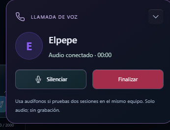
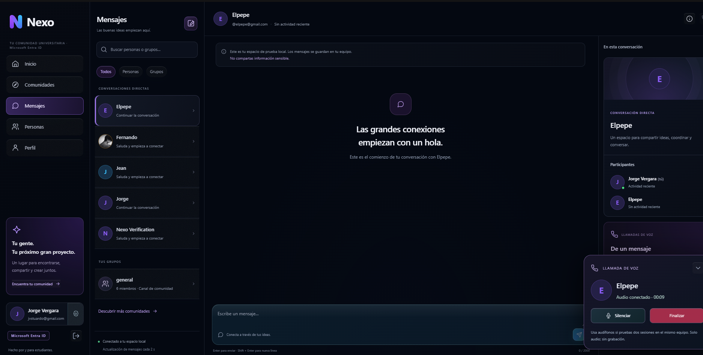
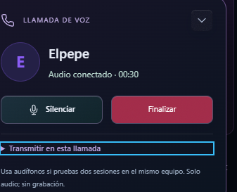
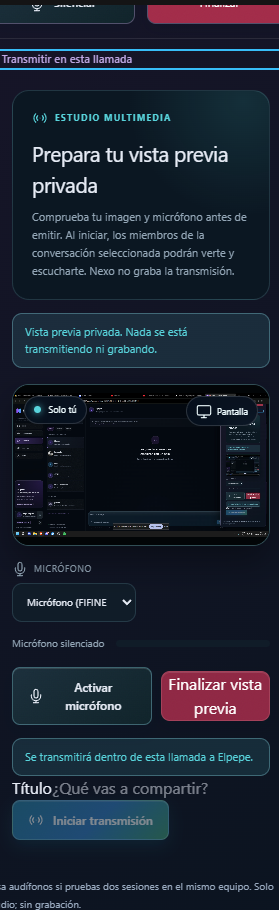
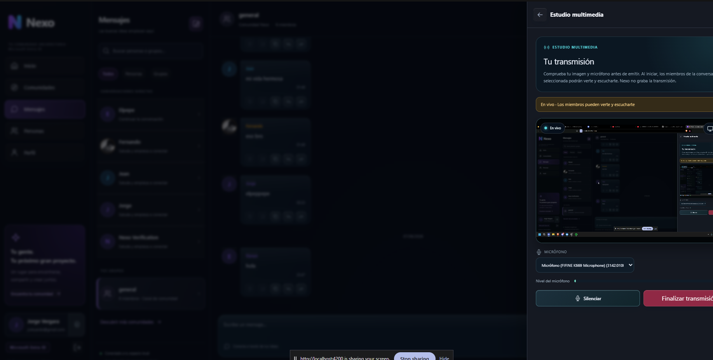
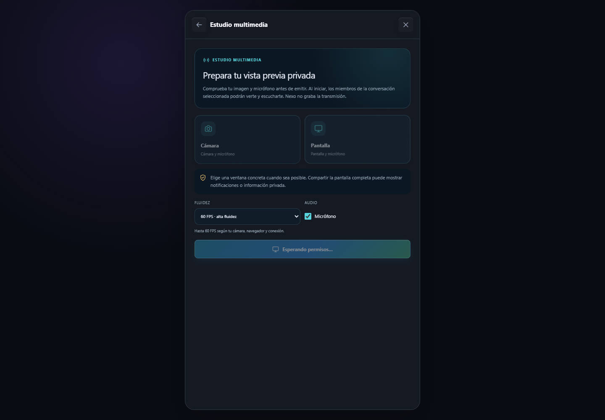
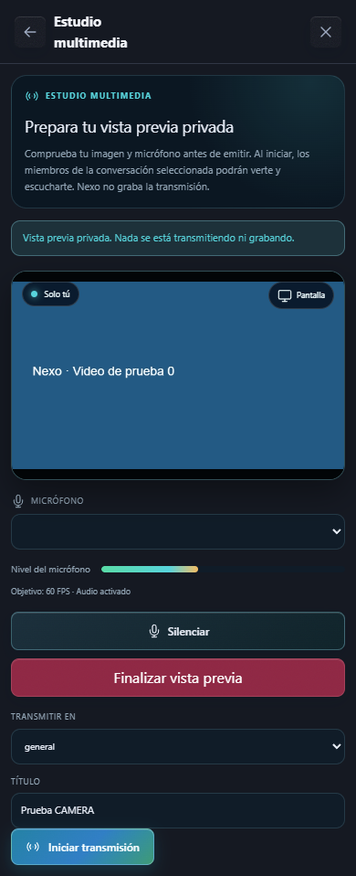
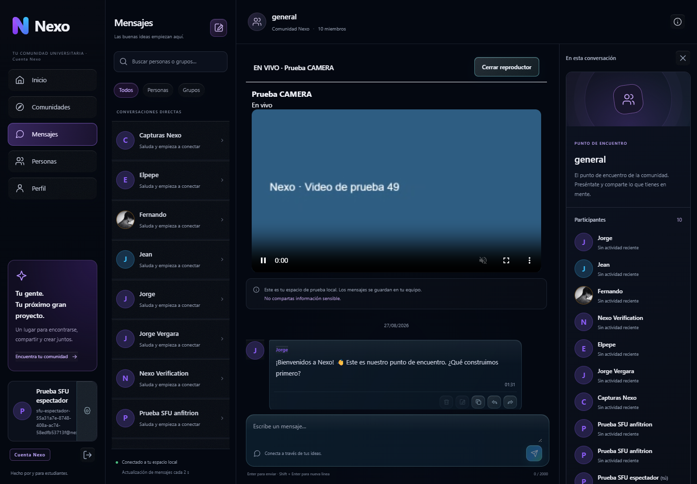
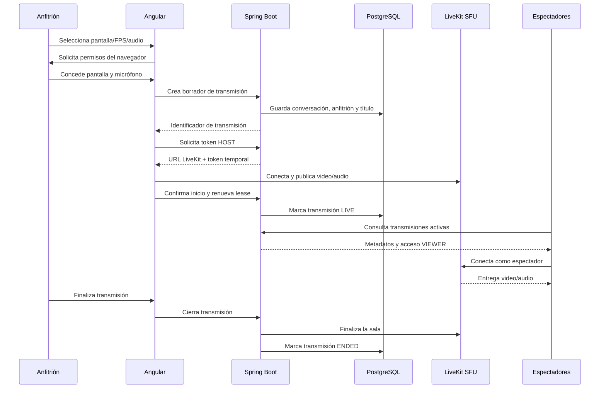

# Nexo · Servicios actuales y transmisiones multimedia

Fecha de actualización: 8 de septiembre de 2026

Rama de trabajo: `feat/despliegue-cloud`

Estado: despliegue académico en EC2 con LiveKit, preparado para aceptación entre dispositivos y redes.

Este documento reúne el funcionamiento actual de Nexo, con especial foco en las llamadas,
el estudio multimedia y las transmisiones de cámara o pantalla hacia otros participantes.
Las imágenes corresponden a la interfaz de pruebas local y sirven como referencia visual del
flujo implementado.

## 1. Resumen del producto

Nexo es una comunidad universitaria con estos servicios actualmente disponibles:

| Servicio | Estado actual | Qué permite |
| --- | --- | --- |
| Acceso | Disponible localmente | Registro/login local, modo demo y estructura para Microsoft Entra ID |
| Perfil | Disponible | Ver y editar perfil, disponibilidad, color y avatar opcional |
| Personas | Disponible | Consultar personas y abrir conversaciones directas |
| Comunidades | Disponible | Consultar canales, unirse, salir y ver participantes |
| Mensajería | Disponible | Enviar, editar, borrar, copiar, responder y reenviar mensajes |
| Llamada de voz | Disponible para pruebas | Llamar, aceptar, rechazar, silenciar, reactivar y finalizar |
| Transmisión multimedia | Disponible localmente | Emitir cámara o pantalla con micrófono mediante LiveKit |
| Visor de transmisiones | Disponible | Los miembros autorizados pueden abrir una emisión activa |
| Temas visuales | Disponible | Tema predeterminado, OLED y claro, con estilos de botones configurables |
| Infraestructura local | Disponible | Angular, Spring Boot, PostgreSQL, Docker y LiveKit |

### Límites conocidos

- Las llamadas de voz son bidireccionales, pero no incluyen video.
- Una transmisión es de un anfitrión hacia varios espectadores. Puede abrirse dentro
  de una llamada grupal, pero conserva sala, permisos y ciclo de vida independientes.
- La validación principal está hecha en localhost y en sesiones del mismo equipo.
- HTTPS/WSS y TURN están configurados en la EC2 académica; falta cerrar la aceptación
  multimedia entre varios dispositivos y redes externas.
- La transmisión no se graba ni se almacena como archivo.

## 2. Capturas de la interfaz

### Llamada responsive

El panel de llamada se adapta a escritorio y móvil. En pantallas pequeñas ocupa el ancho
disponible, limita su altura y permite desplazamiento interno para que el estudio multimedia
no quede cortado.



### Llamada en escritorio

En escritorio la llamada aparece como un panel flotante. Desde el mismo panel se puede
silenciar el micrófono, finalizar la llamada y abrir la sección de transmisión.



### Transmitir dentro de la llamada

Al expandir **Transmitir en esta llamada**, el estudio queda vinculado a la conversación
actual. El destino ya no se elige manualmente: se transmite a los participantes de esa llamada.



### Estudio de pantalla, cámara y audio

El estudio muestra una vista previa privada antes de emitir. Permite seleccionar pantalla o
cámara, revisar el micrófono, elegir dispositivos, ajustar FPS y activar o desactivar el audio.



### Emisión en vivo

Cuando el anfitrión inicia la transmisión, el estado cambia a **En vivo** y los miembros de
la conversación pueden abrir el visor para recibir video y audio.



### Evidencia nueva reproducible

Estas capturas se generaron el 8 de septiembre de 2026 mediante la prueba E2E, con dos
sesiones aisladas y medios sintéticos. La prueba no usa la cámara, el micrófono ni el contenido
real de la pantalla del equipo.

#### Selección de pantalla, 60 FPS y micrófono



#### Vista previa responsive a 390 px



#### Pantalla recibida por otro participante


#### Cámara recibida por otro participante



## 3. Flujo completo para transmitir pantalla

### Como anfitrión

1. Iniciar sesión y abrir **Perfil → Preparar transmisión**.
2. Seleccionar **Pantalla**.
3. Elegir el límite de fluidez:
   - `15 FPS`: menor consumo de CPU y red.
   - `30 FPS`: opción recomendada para la mayoría de presentaciones.
   - `60 FPS`: mayor fluidez para demostraciones, animaciones o videojuegos.
4. Activar **Micrófono** si se desea transmitir la voz. El audio está activado por defecto.
5. Pulsar **Preparar vista previa**.
6. En el diálogo del navegador, elegir una ventana, pestaña o pantalla concreta.
7. Revisar la imagen, el medidor del micrófono y el dispositivo de audio.
8. Seleccionar la conversación de destino, salvo que la transmisión se haya abierto desde
   una llamada activa.
9. Escribir un título y pulsar **Iniciar transmisión**.
10. Para terminar, pulsar **Finalizar transmisión** o detener el uso compartido desde el
    control del navegador.

La vista previa está silenciada localmente para evitar eco. Esto no impide que el micrófono
se publique a los espectadores cuando el audio está activado.

### Dentro de una llamada

1. Iniciar o aceptar una llamada de voz.
2. Expandir **Transmitir en esta llamada**.
3. Seleccionar **Pantalla** o **Cámara**.
4. Configurar FPS y audio.
5. Preparar la vista previa y conceder permisos.
6. Escribir el título de la transmisión.
7. Pulsar **Iniciar transmisión**.

El backend valida que la llamada pertenezca a una conversación directa válida y que ambos
participantes sean miembros. De esta forma, el destino queda asociado a la conversación de
la llamada y no a un identificador enviado libremente por el navegador.

## 4. Qué reciben los otros participantes

Los miembros autorizados consultan las transmisiones activas de la conversación. Cada emisión
aparece con su título y el botón **Ver transmisión**. Al abrirla:

- el espectador recibe video por LiveKit;
- recibe audio si el anfitrión lo dejó activado;
- no necesita cámara ni micrófono;
- no puede publicar contenido en la sala del anfitrión;
- puede reintentar si el navegador bloqueó la reproducción de audio;
- deja de recibir contenido cuando el anfitrión finaliza o la sala expira.

## 5. Configuración de video y audio

### FPS configurables

El valor seleccionado se utiliza en dos puntos:

1. En la captura del navegador, con `frameRate: { ideal, max }`.
2. En la publicación LiveKit, con `maxFramerate` y un bitrate acorde.

Los valores de bitrate configurados son:

| FPS | Bitrate máximo de video |
| ---: | ---: |
| 15 | 1.5 Mbps |
| 30 | 3 Mbps |
| 60 | 6 Mbps |

Elegir 60 FPS establece el objetivo y el límite superior, pero no garantiza que la cámara,
el navegador, el procesador o la red produzcan 60 cuadros reales por segundo. Si el equipo no
puede sostenerlo, el navegador y LiveKit reducirán la tasa efectiva.

### Audio

El audio actual corresponde al micrófono seleccionado. Se puede:

- activar o desactivar antes de iniciar la emisión;
- cambiar el micrófono durante la vista previa;
- silenciar temporalmente desde el estudio o desde el panel de llamada;
- revisar el nivel mediante el medidor local.

En el modo **Pantalla**, el audio del sistema no se captura todavía: se transmite el micrófono.
La captura de audio de una pestaña o del sistema depende además del navegador y del tipo de
fuente elegida, por lo que queda como mejora futura.

## 6. Arquitectura del funcionamiento



Spring Boot controla permisos, membresía, metadatos y ciclo de vida. El audio y video no
atraviesan ni se almacenan en Spring: viajan por WebRTC a través de LiveKit.

## 7. Servicios técnicos locales

| Servicio | Puerto | Responsabilidad |
| --- | ---: | --- |
| Angular | 4200 | Interfaz, permisos del navegador, vista previa y visor |
| Spring Boot | 8080 | Autenticación, conversaciones, llamadas y API de transmisiones |
| PostgreSQL | 5432 | Usuarios, conversaciones, mensajes y metadatos de emisiones |
| LiveKit | 7880 | Señalización y servidor SFU multimedia |
| LiveKit RTC | 7881/7882 | Transporte WebRTC local según configuración de Docker |

Arranque local habitual:

```powershell
docker compose --profile app --profile media up -d --build --wait

cd backend
.\mvnw.cmd spring-boot:run

cd ..\frontend
npm ci
npm start -- --host 127.0.0.1
```

Para activar transmisiones en el backend se requieren variables equivalentes a:

```dotenv
NEXO_BROADCASTS_ENABLED=true
LIVEKIT_API_KEY=clave-local
LIVEKIT_API_SECRET=secreto-local-de-al-menos-32-caracteres
LIVEKIT_INTERNAL_URL=http://127.0.0.1:7880
LIVEKIT_PUBLIC_URL=ws://127.0.0.1:7880
```

## 8. API de transmisiones

Las rutas existen para cuentas autenticadas y para el modo demo bajo `/api/demo`.

| Método | Ruta | Uso |
| --- | --- | --- |
| `GET` | `/api/broadcasts/config` | Consulta si la función está habilitada |
| `POST` | `/api/conversations/{id}/broadcasts` | Crea un borrador de emisión |
| `POST` | `/api/conversations/{id}/group-call/access` | Autoriza a un miembro y entrega acceso temporal a la sala grupal |
| `GET` | `/api/conversations/{id}/broadcasts/active` | Lista emisiones activas de una conversación |
| `POST` | `/api/broadcasts/{id}/access` | Entrega token HOST o VIEWER según permisos |
| `POST` | `/api/broadcasts/{id}/start` | Marca la emisión como activa y renueva su lease |
| `POST` | `/api/broadcasts/{id}/end` | Finaliza la emisión de forma idempotente |

El token de LiveKit es temporal y se mantiene en memoria del cliente. El espectador recibe
`canPublish=false`. El servidor verifica membresía antes de entregar acceso a una emisión.

## 9. Llamadas directas, grupales y transmisiones

| Función | Llamada directa | Llamada grupal de canal | Transmisión |
| --- | --- | --- | --- |
| Tecnología | WebRTC P2P + señalización Spring | LiveKit SFU | LiveKit SFU |
| Participantes | Dos perfiles | Miembros autorizados del canal | Un anfitrión y varios espectadores |
| Publicación | Micrófono de ambos | Micrófono de todos | Cámara/pantalla y pistas de micrófono/audio compartido |
| Autorización | Miembros de conversación directa | Membresía de canal y JWT temporal | Rol anfitrión/espectador y JWT temporal |
| Dirección | Bidireccional | Todos con todos mediante SFU | Un anfitrión a varios espectadores |
| Video | No | No | Cámara o pantalla |
| Audio | Voz de ambos | Voz de todos los conectados | Micrófono y/o audio compartido del anfitrión |
| Grabación | No | No | No |
| Persistencia de medios | Ninguna | Ninguna | Ninguna |

### Flujo de llamada grupal

1. Un miembro abre un canal y pulsa **Unirse a llamada grupal**.
2. Spring valida JWT, tipo `CHANNEL` y membresía.
3. `POST /api/conversations/{id}/group-call/access` crea o reutiliza la sala
   `group-{conversationId}` y devuelve URL y token LiveKit de cinco minutos.
4. Angular conecta, publica el micrófono y se suscribe automáticamente a las pistas
   de los demás participantes.
5. El panel muestra cantidad de participantes, mute, reconexión y salida.
6. **Transmitir en esta llamada grupal** abre el estudio y el visor del canal.

Las llamadas directas y grupales son excluyentes en una misma pestaña para evitar
competencia por el micrófono. La autorización impide el acceso de usuarios que hayan
salido del canal. El token no se persiste y el audio nunca atraviesa Spring.

## 10. Privacidad y seguridad

- La pantalla y el micrófono solo se solicitan después de una acción explícita del usuario.
- La vista previa no se transmite ni se graba.
- Solo los miembros de la conversación pueden consultar y abrir una emisión.
- El espectador no publica audio ni video.
- El backend deriva anfitrión, identidad y permisos desde la sesión autenticada.
- Los metadatos de la emisión se guardan; no se guardan audio, video, SDP ni tokens.
- Se recomienda utilizar audífonos al probar dos sesiones en el mismo computador.
- Para producción todavía faltan límites operativos, eventos firmados y completar las
  pruebas documentadas entre redes externas.

## 11. Verificación realizada

En la rama actual se verificó:

- Backend: suite Maven completa aprobada, incluida autorización de llamadas grupales.
- Frontend: `77` pruebas aprobadas en `22` archivos.
- `npm run format:check`: correcto.
- `npm run build`: correcto.
- Vista previa de cámara y pantalla con liberación de tracks.
- Publicación separada de video y micrófono.
- Rol de espectador sin permisos de publicación.
- Reconexión, autoplay bloqueado y finalización de salas.
- Panel responsive y estudio embebido dentro de una llamada.
- Configuración de 15/30/60 FPS y audio opcional.
- Comprobación automática de que el estudio no produce desbordamiento horizontal a 390 px.
- E2E en Brave con cámara y pantalla sintéticas: recepción de audio/video, espectador de solo
  lectura, mute/reactivación, cierre remoto, liberación de tracks y limpieza del lease: `PASS`.

La tasa real de cuadros debe medirse con dispositivos físicos y redes distintas antes de
declarar una calidad de 60 FPS garantizada.

### Regenerar las capturas y la prueba E2E

Con Angular, Spring Boot, PostgreSQL y LiveKit activos, ejecutar desde la raíz:

```powershell
$env:NODE_PATH='<ruta-al-node_modules-que-contiene-playwright>'
$env:NEXO_BROWSER_EXECUTABLE='C:\Program Files\BraveSoftware\Brave-Browser\Application\brave.exe'
$env:NEXO_CAPTURE_DIR='docs/images/broadcast/current'
node scripts/verify-broadcast.cjs
```

Si Edge está instalado, se puede omitir `NEXO_BROWSER_EXECUTABLE`; el script conserva Edge como
valor predeterminado. `NEXO_CAPTURE_DIR` también es opcional y, si se omite, las capturas quedan
en `.tmp/`. Las cuentas E2E son sintéticas y sus credenciales locales se conservan en `.tmp/`,
directorio ignorado por Git.

## 12. Próximas mejoras recomendadas

1. Mostrar FPS efectivos recibidos junto al FPS objetivo.
2. Incorporar selección de resolución y perfil de calidad.
3. Permitir audio del sistema cuando el navegador y la fuente lo soporten.
4. Completar evidencia de STUN/TURN y HTTPS/WSS con tres cuentas en redes distintas.
5. Añadir eventos firmados de LiveKit y revocación de membresía durante una emisión.
6. Incorporar métricas de bitrate, pérdida de paquetes, latencia y cuadros descartados.
7. Validar cámara, micrófono y captura de pantalla en equipos físicos variados.

## Referencias del repositorio

- [README principal](../README.md)
- [Configuración y verificación LiveKit](broadcast-sfu-verification.md)
- [Estudio multimedia local](multimedia-studio-verification.md)
- [Verificación de llamadas y perfiles](photos-and-calls-verification.md)
- [Preparación de fase 5](phase-5-readiness.md)
