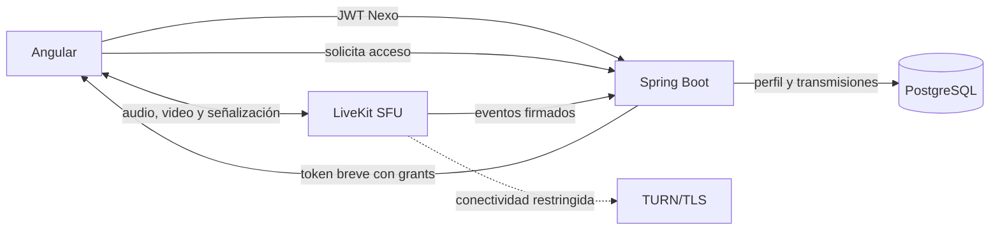

# Plan de implementación: perfil editable y transmisiones

## 1. Objetivo

Convertir el mockup de perfil y transmisión en una función real de Nexo que permita:

- consultar el perfil propio dentro del espacio de trabajo;
- editar los datos que pertenecen a Nexo sin alterar la identidad de acceso;
- actualizar o quitar el avatar con cualquier tipo de cuenta autenticada;
- preparar una transmisión con pantalla o cámara y micrófono;
- transmitir a los miembros autorizados de una conversación;
- silenciar, reanudar y finalizar la transmisión de forma segura.

La implementación debe conservar los tres modos de autenticación actuales: cuenta local,
Microsoft Entra ID y demostración local.

## 2. Estado real del repositorio

### Capacidades reutilizables

- `GET /api/users/me` ya resuelve la identidad autenticada y devuelve `UserView`.
- `nexo.users` ya contiene `username`, `display_name`, `color`, `bio`, `status` y
  `avatar_version`.
- La subida de avatar ya valida tamaño, dimensiones y contenido, recorta la imagen y la
  normaliza a PNG.
- El frontend ya tiene una ruta `/profile`, un `ProfileService`, un panel reutilizable,
  un formulario reactivo y el componente compartido `nexo-avatar`.
- Existe una llamada WebRTC uno-a-uno para cuentas demo, locales y Microsoft, con permiso de
  micrófono, mute, liberación de tracks y pruebas automatizadas.
- La autorización de canales y conversaciones ya se controla en el backend por membresía.

### Brechas que deben resolverse

- `status` representa el estado administrativo de la cuenta (`ACTIVE`), por lo que no debe
  reutilizarse como «Disponible/Ocupado/Ausente».
- La llamada autenticada usa señalización HTTP por polling, vive en memoria, está verificada
  solo entre pestañas del mismo equipo y rechaza explícitamente SDP con video.
- No hay modelo de transmisión, permisos publicador/espectador, descubrimiento de directos,
  servidor SFU, TURN ni pruebas entre redes.

## 3. Decisiones de arquitectura

### 3.1 Separar identidad y perfil

Los campos deben tener un propietario claro:

| Dato                                              | Propietario             | Editable en Nexo |
| ------------------------------------------------- | ----------------------- | ---------------- |
| Correo y proveedor de acceso                      | Cuenta local o Entra ID | No               |
| Estado administrativo de cuenta                   | Backend Nexo            | No               |
| Nombre visible, nombre público, biografía y color | Perfil Nexo             | Sí               |
| Avatar                                            | Perfil Nexo             | Sí               |
| Disponibilidad                                    | Usuario Nexo            | Sí               |

Para Entra ID, los claims deben inicializar correo y nombre al crear la cuenta, pero una
sincronización posterior no debe borrar una personalización hecha en Nexo. La solución
recomendada es guardar las personalizaciones como valores propios y conservar los datos del
proveedor por separado, o añadir una marca `profile_customized_at` que impida sobrescribir los
campos públicos.

### 3.2 Separar plano de control y plano de medios

Spring Boot seguirá controlando identidad, membresía, metadatos, permisos y emisión de tokens.
El audio y el video no deben atravesar Spring ni guardarse en PostgreSQL.

Para una transmisión con varios espectadores se recomienda un SFU. WebRTC P2P funciona bien
con dos o tres participantes, pero obliga al emisor a subir una copia por receptor y deja de
ser una buena base para grupos. LiveKit ofrece un SFU, SDK web, tokens con permisos de sala y
una opción autoalojada. El backend debe emitir tokens breves; nunca el navegador.



Documentación de referencia:

- [Arquitectura SFU de LiveKit](https://docs.livekit.io/reference/internals/livekit-sfu/).
- [Tokens y permisos de sala](https://docs.livekit.io/home/server/generating-tokens).
- [Despliegue autoalojado, TLS y TURN](https://docs.livekit.io/transport/self-hosting/deployment/).
- [Captura de pantalla y riesgos de privacidad](https://developer.mozilla.org/en-US/docs/Web/API/Screen_Capture_API/Using_Screen_Capture).
- [Permisos de cámara y micrófono](https://developer.mozilla.org/en-US/docs/Web/API/MediaDevices/getUserMedia).

## 4. Contratos propuestos

### Perfil

```text
GET    /api/users/me
PATCH  /api/users/me/profile
POST   /api/users/me/avatar
DELETE /api/users/me/avatar
GET    /api/avatars/{userId}/{version}
```

`PATCH /api/users/me/profile` aceptará únicamente los campos editables:

```json
{
  "displayName": "Jean Valenzuela",
  "username": "jean.valenzuela",
  "bio": "Construyendo Nexo",
  "color": "#8B5CF6",
  "availability": "AVAILABLE"
}
```

Reglas mínimas:

- identidad siempre derivada del JWT o de la sesión demo;
- `displayName`: 1 a 120 caracteres;
- `username`: normalizado, único sin distinguir mayúsculas y con formato explícito;
- `bio`: máximo 250 caracteres y representada como texto, no HTML;
- `color`: lista permitida o formato hexadecimal validado;
- `availability`: `AVAILABLE`, `BUSY` o `AWAY`;
- conflicto de nombre público: HTTP `409`;
- validación: respuesta `400` con campos identificables por el formulario.

### Transmisiones

```text
POST /api/conversations/{conversationId}/broadcasts
GET  /api/conversations/{conversationId}/broadcasts/active
POST /api/broadcasts/{broadcastId}/access
POST /api/broadcasts/{broadcastId}/start
POST /api/broadcasts/{broadcastId}/end
POST /api/integrations/livekit/events
```

- Crear transmisión genera un borrador asociado al usuario y la conversación.
- `access` deriva el rol del usuario en el servidor:
  - anfitrión: publicar y suscribirse;
  - espectador: solo suscribirse;
  - usuario sin membresía: `403`.
- El cliente nunca decide su propia identidad, sala ni permiso de publicación.
- Los tokens del proveedor multimedia deben ser breves y no almacenarse en logs ni en
  `localStorage`.
- `start` y `end` deben ser idempotentes.

## 5. Persistencia

### Migración V9: perfil

- Añadir `availability` separado del `status` administrativo.
- Añadir la estrategia elegida para personalizaciones de Entra, por ejemplo
  `profile_customized_at`.
- Crear índice único por `lower(username)` si el nombre público será editable sin distinguir
  mayúsculas.
- Mantener `user_avatars` y generalizarlo para `LOCAL`, `ENTRA` y `DEMO`.

### Migración V10: transmisiones

Crear `nexo.broadcasts` con:

- `id`, `conversation_id`, `host_id` y `room_name`;
- `title` y `source_type` (`SCREEN` o `CAMERA`);
- `status` (`DRAFT`, `STARTING`, `LIVE`, `ENDED`, `FAILED`);
- `created_at`, `started_at`, `ended_at` y motivo de finalización;
- restricciones de clave foránea e índices por conversación y estado;
- índice parcial que impida más de una transmisión activa del mismo anfitrión.

No guardar SDP, ICE candidates, audio, video ni tokens del SFU en PostgreSQL. Una tabla de
participantes o grabaciones se añadirá solo si el alcance académico lo exige.

## 6. Ruta de ejecución

### Fase 1 — Perfil autenticado en backend

**Estado:** completada en `feature/authenticated-workspace`. La migración V9, los contratos
autenticados, los adaptadores demo y las pruebas de integración están implementados.

1. Crear DTOs de actualización y validaciones.
2. Incorporar `PATCH /api/users/me/profile` usando `CurrentUserService.require`.
3. Generalizar `AvatarService`; retirar su dependencia exclusiva de `DemoUsers`.
4. Crear endpoints autenticados de avatar y mantener rutas demo como adaptadores mientras sean
   necesarias.
5. Actualizar `SecurityConfig` e `isJwtProtectedPath`.
6. Actualizar `UserView`, `UserEntity.avatarUrl` y consultas de mensajes.
7. Añadir migración V9 y pruebas de integración.

**Criterio de salida:** una cuenta local y una cuenta Entra pueden editar solo su perfil,
subir/quitar avatar y ver el cambio en perfil, mensajes y participantes.

### Fase 2 — Perfil y edición en Angular

**Estado:** completada en `feature/authenticated-workspace`. El panel y el formulario son
reutilizables, se adaptan a escritorio/móvil y conservan compatibilidad con demo, cuenta local
y Microsoft. La persistencia y la recarga se validaron desde la interfaz real. El cierre de
brechas incorpora contención y restauración del foco, protección de borradores ante refrescos
del perfil y bloqueo de navegación durante operaciones pendientes.

1. Extraer `ProfilePanelComponent` reutilizable desde la página actual.
2. Crear `ProfileEditFormComponent` con Reactive Forms.
3. Adaptar `ProfileService` a las rutas autenticadas y conservar compatibilidad demo.
4. Abrir el perfil desde el avatar del espacio de trabajo; en móvil mostrarlo como vista
   completa y en escritorio como panel lateral.
5. Aplicar actualizaciones optimistas solo donde puedan revertirse; para avatar y nombre,
   sustituir el estado después de recibir `UserView` del servidor.
6. Gestionar foco, teclado, estados de carga, errores por campo y navegación sin perder cambios.

**Criterio de salida:** el flujo del mockup funciona con datos persistentes y recarga correcta.

### Entrega intermedia — Llamadas de voz autenticadas

**Estado:** completada en `feature/authenticated-workspace`. Las cuentas demo, locales y
Microsoft comparten el flujo de llamada de solo audio. La identidad se deriva de la sesión
autenticada y un UUID por pestaña permite que solo la primera sesión que acepta reclame la
llamada.

1. Exponer la señalización en `/api/calls` para identidades locales y Microsoft.
2. Conservar `/api/demo/calls` como adaptador del modo demo.
3. Montar el panel global de llamada para que continúe visible al navegar.
4. Habilitar los botones de llamada para cualquier cuenta autenticada.
5. Incluir el identificador de pestaña en cada operación y permitirlo mediante CORS.
6. Cubrir inicio, aceptación, respuesta, conexión y cierre en pruebas de integración.

**Criterio de salida:** dos cuentas autenticadas pueden iniciar, aceptar, silenciar y finalizar
una llamada de voz entre dos pestañas del mismo equipo.

### Fase 3 — Estudio multimedia local, sin emitir

1. Crear `MediaDeviceService` responsable de permisos y liberación de tracks.
2. Implementar `BroadcastStudioComponent` con estado explícito:
   `IDLE → PREVIEWING → CONNECTING → LIVE → ENDING/ERROR`.
3. Solicitar micrófono/cámara solamente después de una acción del usuario.
4. Usar `getDisplayMedia` para pantalla y `getUserMedia` para cámara/micrófono.
5. Mostrar vista previa, selector de dispositivo, indicador de nivel, mute y finalización.
6. Escuchar `track.onended`, cambios de dispositivo y cierre de ruta para detener todos los
   tracks.
7. Detectar capacidades; si compartir pantalla no está disponible, ofrecer cámara/micrófono sin
   prometer esa función.

**Criterio de salida:** el usuario puede probar pantalla, cámara y audio localmente sin enviar
datos a otro usuario y sin dejar dispositivos activos al salir.

### Fase 4 — Transmisión funcional mediante SFU

1. Levantar LiveKit local como perfil opcional de Docker Compose con secretos solo en `.env`.
2. Añadir el cliente web de LiveKit y un servicio Angular `BroadcastMediaService`.
3. Añadir al backend el cliente servidor de LiveKit y el emisor de tokens con grants mínimos.
4. Implementar V10, repositorio, servicio y controladores de transmisiones.
5. Publicar pantalla/cámara y micrófono como tracks separados para permitir mute independiente.
6. Implementar `BroadcastViewerComponent` para suscripción, autoplay recuperable y reconexión.
7. Mostrar la transmisión activa en el canal y actualizar su estado inicialmente por polling;
   sustituirlo por WebSocket cuando se implemente presencia en tiempo real.

**Criterio de salida:** dos cuentas autenticadas distintas pueden iniciar y ver una transmisión
local, con permisos de anfitrión/espectador aplicados por el backend.

### Fase 5 — Seguridad, conectividad y despliegue

1. Publicar frontend, API y señalización bajo HTTPS/WSS.
2. Configurar `Permissions-Policy` para `camera`, `microphone` y `display-capture` solo en el
   origen permitido.
3. Configurar TURN/TLS y los puertos/firewall requeridos; probar redes domésticas, móviles,
   universitarias y VPN.
4. Validar webhooks firmados del SFU y cerrar transmisiones huérfanas.
5. Añadir límites de participantes, bitrate, duración, concurrencia y frecuencia de creación.
6. Registrar métricas de conexión, latencia, reconexión y errores ICE sin registrar contenido
   multimedia ni tokens.
7. Activar mediante `NEXO_BROADCASTS_ENABLED` y desplegar primero en un entorno de prueba.

**Criterio de salida:** la transmisión funciona entre dos dispositivos y redes diferentes con
recuperación documentada ante fallos.

## 7. Pruebas obligatorias

### Backend

- edición propia correcta para `LOCAL`, `ENTRA` y `DEMO`;
- rechazo de modificación de correo, proveedor, estado administrativo o ID;
- conflicto y normalización de `username`;
- avatar real, imagen falsa, archivo sobredimensionado y acceso de otro usuario;
- membresía, rol publicador/espectador y token vencido;
- inicio/fin idempotentes y una sola transmisión activa;
- webhook inválido, duplicado y fuera de orden.

### Frontend

- formulario válido, errores de servidor y advertencia por cambios sin guardar;
- vista de perfil de escritorio y móvil;
- permiso denegado o pendiente, dispositivo inexistente y dispositivo desconectado;
- pantalla cancelada por el usuario;
- mute sin destruir el track y cierre liberando todos los tracks;
- reconexión, finalización remota y bloqueo de publicación para espectadores.

### Validación de extremo a extremo

- anfitrión y espectador en perfiles de navegador independientes;
- pantalla con micrófono, cámara con micrófono, mute y finalización;
- usuario no miembro rechazado;
- recarga/cierre inesperado del anfitrión;
- Chrome y Edge primero; Firefox/Safari según el alcance acordado;
- prueba final entre redes distintas usando TURN, no solo dos pestañas del mismo equipo.

## 8. Consideraciones necesarias

### Privacidad

- No activar micrófono, cámara ni pantalla al abrir el panel.
- Mantener un indicador visible mientras exista un track publicado.
- Avisar que compartir pantalla puede exponer notificaciones, contraseñas u otras ventanas.
- La primera entrega no debe grabar. Grabación, moderación y retención requieren una decisión
  funcional y legal independiente.

### Seguridad

- Autorizar cada operación con la identidad del servidor; nunca confiar en `hostId` enviado por
  el navegador.
- Mantener secretos de LiveKit fuera de Angular, Git y respuestas de diagnóstico.
- Reencodificar avatares elimina metadatos y reduce el riesgo de contenido malicioso; conservar
  límites de píxeles y bytes.
- Renderizar biografía y títulos como texto para evitar HTML almacenado.

### Experiencia de usuario

- Escritorio: panel lateral; móvil: vista completa con regreso claro.
- Separar «Preparar» de «Iniciar transmisión» para que el permiso no implique emisión.
- Mostrar estados concretos: solicitando permiso, conectando, en vivo, reconectando y finalizado.
- Evitar que cerrar visualmente el panel deje una transmisión o dispositivo activo sin aviso.

### Infraestructura y costo

- Para la tesis, comenzar con una instancia local o de staging de LiveKit.
- Para producción autoalojada se requieren dominio, certificado confiable, WSS, TURN y reglas de
  red. LiveKit recomienda Redis cuando el despliegue se distribuye en varios nodos.
- El costo dominante será ancho de banda de salida, TURN y, si se agrega, grabación/transcodificación.
- No incorporar Kubernetes, Redis o grabación en la primera vertical si aún no resuelven un
  requisito medido.

## 9. Orden recomendado de trabajo

1. **Perfil autenticado completo (completado)**: menor riesgo y máximo reaprovechamiento del código actual.
2. **Panel Angular reutilizable (completado)**: materializa el mockup con persistencia real.
3. **Vista previa multimedia local**: valida permisos y UX sin introducir infraestructura.
4. **Transmisión SFU local con dos usuarios**: primera vertical audiovisual completa.
5. **TURN/HTTPS y prueba entre redes**: convierte la demo local en una función verificable.
6. **Tiempo real, límites y observabilidad**: endurecimiento antes del despliegue.

El siguiente cambio recomendado es la Fase 3: construir la vista previa multimedia local sin
emitir. Aún no conviene ampliar `VoiceCallService`: su contrato actual es demo,
uno-a-uno y audio-only; mezclarlo con transmisiones haría más difícil asegurar y probar
ambos flujos.
